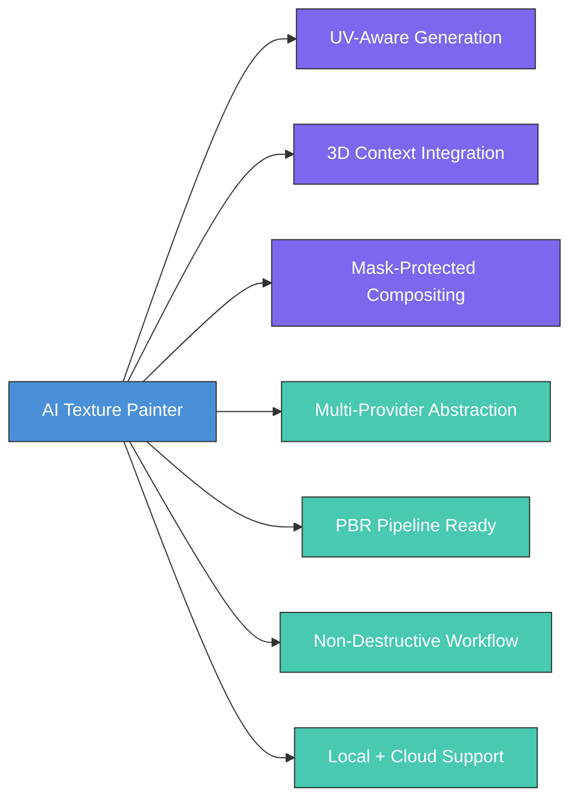

# 01 — Proje Genel Bakış

> AI Texture Painter: Blender için AI destekli profesyonel texture editing ortamı.

---

## 1.1 Vizyon

Blender'ın mevcut 2D Image Editor, Texture Paint ve UV workflow'unu AI destekli profesyonel bir texture editing ortamına dönüştürmek. Kullanıcının Blender'da 3D modeli boyarken, **Photoshop 2026 seviyesindeki generative AI iş akışlarını** doğrudan texture/UV ve 3D viewport bağlamında kullanabilmesini sağlamak.

### Vizyonun Özü

> Bu addon yalnızca "AI ile resim üretme" aracı değildir. Blender'ın UV, texture, material, viewport ve mümkün olduğunda geometry context bilgisini AI generation/editing pipeline'ına dahil eden bir **AI Texture Painting Environment** oluşturmayı hedefler.

### Uzun Vadeli Hedef

```
              3D MODEL
                  │
        ┌─────────┴─────────┐
        │                   │
    3D PAINT            UV EDITOR
        │                   │
        └─────────┬─────────┘
                  │
           AI TEXTURE ENGINE
                  │
       ┌──────────┼──────────┐
       │          │          │
     FILL       REMOVE     GENERATE
       │          │          │
       └──────────┼──────────┘
                  │
           MATERIAL ENGINE
                  │
        ┌─────────┼─────────┐
        │         │         │
       BASE     NORMAL    ROUGHNESS
       COLOR               │
        │         │         │
        └─────────┼─────────┘
                  │
               MATERIAL
```

---

## 1.2 Problem Tanımı

### Mevcut Durum

3D sanatçılar texture oluştururken şu sorunlarla karşılaşır:

1. **Workflow kopukluğu**: Blender → Photoshop/Substance → Blender arası sürekli geçiş
2. **Zaman kaybı**: Manuel texture painting çok zaman alıcı
3. **Beceri eşiği**: Profesyonel kalitede texture üretmek yüksek beceri gerektirir
4. **Tutarsızlık**: UV seam'lerde ve farklı texture kanallarında tutarsızlıklar
5. **İterasyon zorluğu**: Texture değişiklikleri genellikle destructive

### Çözümümüz

AI Texture Painter bu sorunları şöyle çözer:

| Problem | Çözüm |
|:--------|:------|
| Workflow kopukluğu | Tüm AI işlemleri Blender içinde |
| Zaman kaybı | Prompt tabanlı hızlı generation |
| Beceri eşiği | AI destekli profesyonel kalite |
| Tutarsızlık | UV-aware generation, seamless texture |
| İterasyon zorluğu | Non-destructive workflow, undo/redo |

---

## 1.3 Hedef Kitle

### Birincil Kullanıcılar

| Segment | Açıklama | Temel İhtiyaç |
|:--------|:---------|:--------------|
| **3D Game Sanatçıları** | Oyun asset'leri üreten sanatçılar | Hızlı PBR texture üretimi |
| **Freelance 3D Sanatçılar** | Bağımsız çalışan sanatçılar | Tek başına profesyonel sonuçlar |
| **Indie Oyun Geliştiriciler** | Küçük ekiplerle çalışan stüdyolar | Düşük maliyetli yüksek kalite |
| **Mimari Görselleştirme** | ArchViz profesyonelleri | Gerçekçi material texture'ları |

### İkincil Kullanıcılar

| Segment | Açıklama | Temel İhtiyaç |
|:--------|:---------|:--------------|
| **Eğitimciler** | 3D eğitim içerik üreticileri | Hızlı prototipleme |
| **Hobi Kullanıcılar** | Kişisel projeler için Blender kullananlar | Kolay AI erişimi |
| **VFX Stüdyoları** | Film/reklam VFX ekipleri | Hızlı iterasyon |

---

## 1.4 Pazar Analizi

### Mevcut Rakipler (Ağustos 2026)

#### Dream Textures
- **Tür**: Açık kaynak, local inference
- **Güçlü**: Stable Diffusion entegrasyonu, ücretsiz, gizlilik
- **Zayıf**: Yüksek GPU gereksinimi (RTX 3060+), sınırlı inpaint kontrolü
- **Fark**: UV-aware pipeline yok, mask-protected compositing zayıf

#### Textures Diffusion v2
- **Tür**: Ücretli, cloud-based
- **Güçlü**: Global Texture (çok açılı seam-free), Live Paint, multi-provider
- **Zayıf**: Cloud bağımlı, kullanım başına ödeme, offline çalışmaz
- **Fark**: 3D viewport context desteği sınırlı

#### AI Texture Generator Pro
- **Tür**: Ücretli addon
- **Güçlü**: PBR material üretimi, product design odaklı
- **Zayıf**: Sınırlı mask kontrolü, tek provider bağımlılığı
- **Fark**: İnce mask kontrolü ve compositing pipeline eksik

#### BlendAI
- **Tür**: Genel amaçlı AI asistanı
- **Güçlü**: Çok amaçlı, inpainting dahil
- **Zayıf**: Texture-specific workflow eksik, UV entegrasyonu zayıf
- **Fark**: Texture authoring'e özel değil

### Rekabet Avantajlarımız



### Pazar Fırsatı

| Faktör | Durum |
|:-------|:------|
| Blender kullanıcı sayısı | 10M+ (2026 tahmini) |
| AI texture araçları talebi | Hızla büyüyen |
| Blender Extensions Platform | Yeni dağıtım kanalı |
| Generative AI olgunluğu | Production-ready seviyede |
| Rekabet | Niş alanlar hala açık |

---

## 1.5 Temel Hedefler

### Birincil Hedefler (MVP)

1. ✅ Blender Image Editor içinde AI destekli generative editing
2. ✅ UV texture üzerinde maskeli AI generation/editing
3. ✅ 3D viewport'taki seçili yüzeyleri AI işlemlerine bağlama
4. ✅ Mevcut texture'ın yalnızca seçilen bölgelerini değiştirme
5. ✅ Non-destructive workflow
6. ✅ Undo/redo ve variation sistemi
7. ✅ Reference image desteği
8. ✅ Farklı AI sağlayıcılarını tek bir abstraction altında destekleme
9. ✅ Local AI ve remote API kullanımına uygun mimari
10. ✅ PBR texture workflow'una genişleyebilme

### Tasarım İlkesi

> **AI hiçbir zaman kullanıcının istemediği alanları değiştirmemelidir.**

Özellikle texture editing sırasında:
- Maskelenmeyen pikseller korunmalı
- Mevcut texture mümkün olduğunca korunmalı
- Generated result kontrollü şekilde composite edilmeli

---

## 1.6 Mühendislik İlkesi

Her özellik eklenirken şu soru sorulmalıdır:

> "Bu özellik Blender'ın mevcut workflow'unu gerçekten hızlandırıyor mu?"

Eğer cevap hayırsa, yalnızca AI gösterisi olduğu için özellik eklenmemelidir.

### Öncelik Sırası

```
1. Kontrol
2. Determinism
3. Non-destructive editing
4. Texture quality
5. Workflow speed
6. AI quality
7. Advanced automation
```

> **AI kullanıcının kontrolünü azaltmamalı; artırmalıdır.**

---

## 1.7 Photoshop Benzeri Özellikler (Blender Uyarlamalı)

Bu proje Photoshop'un UI'ını kopyalamamalıdır. Ancak aşağıdaki generative concepts Blender workflow'una uyarlanmalıdır:

| Photoshop Özelliği | Blender Uyarlaması |
|:--------------------|:-------------------|
| Generative Fill | UV mask tabanlı AI texture fill |
| Generative Remove | Texture üzerinde AI ile silme |
| Generative Expand | Texture sınırlarını AI ile genişletme |
| Generate Image | Tamamen yeni texture üretimi |
| Reference Image | Referans görselle yönlendirme |
| Variations | Çoklu sonuç karşılaştırma |
| Upscale | Texture çözünürlük artırma |
| AI-assisted editing | Prompt tabanlı texture düzenleme |

---

## 1.8 Başarı Kriterleri

### MVP Tamamlanma Kriteri

MVP ancak aşağıdaki workflow **tamamen çalışıyorsa** tamamlanmış sayılır:

```
 1. Blender açılır
 2. Addon aktif edilir
 3. Image Editor'da texture açılır
 4. Kullanıcı mask oluşturur
 5. AI Texture Painter paneli açılır
 6. Prompt girilir
 7. Generate tıklanır
 8. Provider request oluşturulur
 9. Result alınır
10. Result preview edilir
11. Mask dışındaki orijinal pikseller korunur
12. Kullanıcı Apply der
13. Blender texture güncellenir
14. Material viewport'ta güncellenir
15. Undo mümkün olur
```

### KPI'lar

| Metrik | Hedef |
|:-------|:------|
| Mask dışı piksel korunma oranı | %100 |
| Generation → Preview süresi | < 30 saniye |
| Apply işlemi süresi | < 2 saniye |
| UI thread blocking | 0 ms |
| Desteklenen provider sayısı (MVP) | 2+ (Mock + 1 gerçek) |
| Blender 5.x uyumluluk | 5.0 — 5.3 |

---

*Sonraki bölüm: [02 — Mimari Tasarım](./02-ARCHITECTURE.md)*
