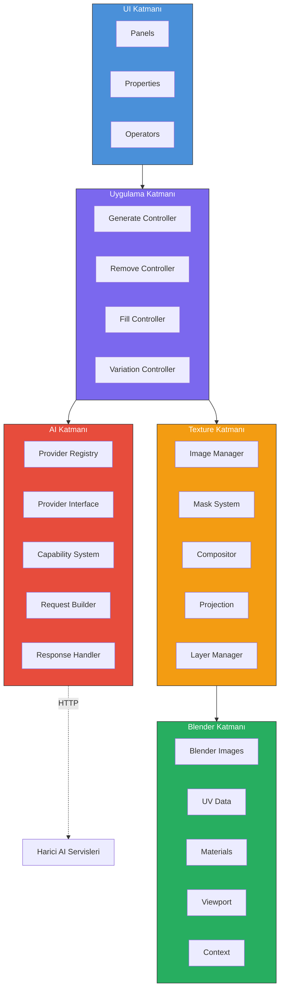
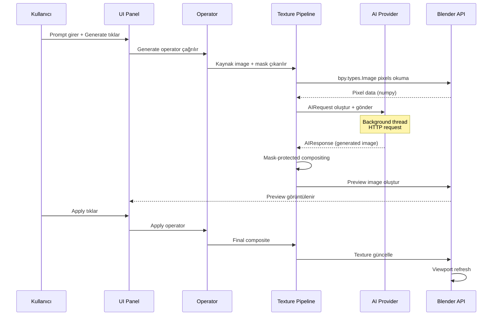
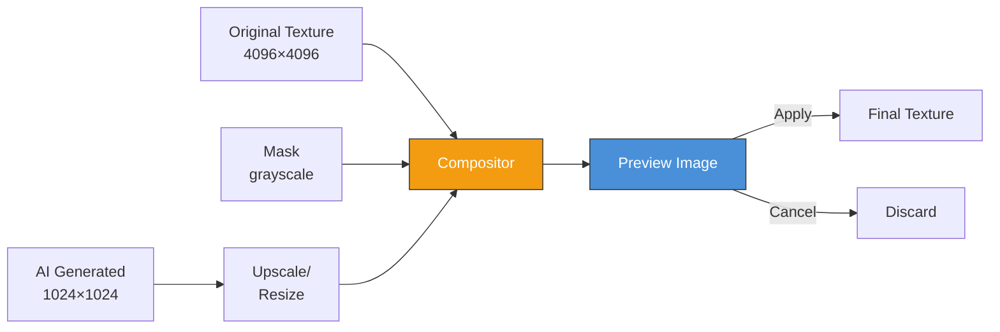
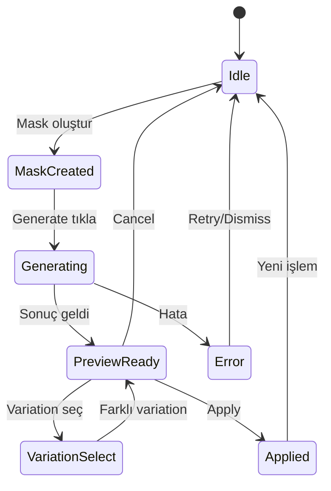
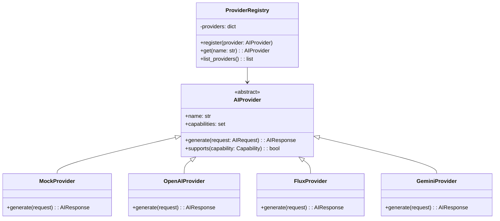
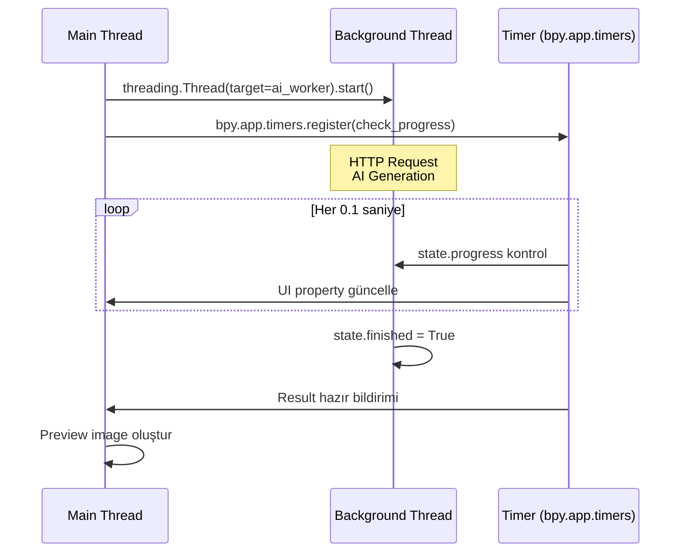
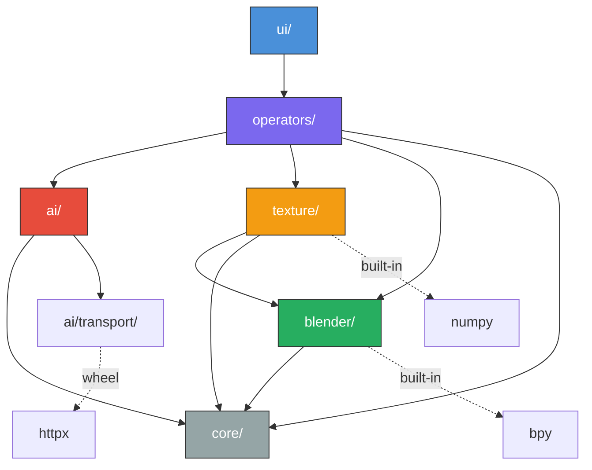

# 02 — Mimari Tasarım

> AI Texture Painter teknik mimarisi, modül yapısı ve tasarım kararları.

---

## 2.1 Mimari Genel Bakış

### Katmanlı Mimari



### Temel İlkeler

1. **Separation of Concerns**: Her katman kendi sorumluluğuna sahip
2. **Dependency Inversion**: UI hiçbir AI provider'ın API'sini doğrudan çağırmamalı
3. **Adapter Pattern**: Blender API değişikliklerine karşı adapter katmanı
4. **Non-destructive**: Orijinal texture'ı korumak her zaman öncelik

---

## 2.2 Modül Yapısı

```
ai_texture_painter/
│
├── __init__.py                    # Extension entry point
├── blender_manifest.toml          # Blender 5.x extension manifest
│
├── core/                          # Çekirdek iş mantığı
│   ├── __init__.py
│   ├── project.py                 # Proje yönetimi
│   ├── state.py                   # Global state management
│   ├── config.py                  # Konfigürasyon
│   └── logging.py                 # Structured logging
│
├── ai/                            # AI provider sistemi
│   ├── __init__.py
│   ├── provider.py                # Base provider interface
│   ├── registry.py                # Provider registry
│   ├── request.py                 # AIRequest model
│   ├── response.py                # AIResponse model
│   ├── capabilities.py            # Capability enum & system
│   │
│   ├── providers/                 # Concrete provider'lar
│   │   ├── __init__.py
│   │   ├── mock.py                # Mock provider (test)
│   │   ├── local.py               # Local AI backend
│   │   ├── openai.py              # OpenAI/DALL-E
│   │   ├── flux.py                # Flux/Replicate
│   │   ├── gemini.py              # Google Gemini
│   │   └── adobe.py               # Adobe Firefly
│   │
│   └── transport/                 # HTTP transport katmanı
│       ├── __init__.py
│       └── http.py                # Async HTTP client
│
├── texture/                       # Texture processing
│   ├── __init__.py
│   ├── image.py                   # Image operations
│   ├── mask.py                    # Mask system
│   ├── composite.py               # Compositing engine
│   ├── projection.py              # UV ↔ texture projection
│   └── layers.py                  # Layer management
│
├── blender/                       # Blender API adapter katmanı
│   ├── __init__.py
│   ├── images.py                  # bpy.types.Image wrapper
│   ├── uv.py                      # UV data extraction
│   ├── materials.py               # Material/shader node
│   ├── viewport.py                # 3D viewport operations
│   └── context.py                 # Blender context adapter
│
├── operators/                     # Blender operators
│   ├── __init__.py
│   ├── generate.py                # AI generation operator
│   ├── remove.py                  # AI remove operator
│   ├── fill.py                    # AI fill operator
│   ├── variation.py               # Variation management
│   └── apply.py                   # Apply/cancel operations
│
├── ui/                            # Kullanıcı arayüzü
│   ├── __init__.py
│   ├── panels.py                  # Side panel (N-panel)
│   ├── properties.py              # Custom properties
│   └── menus.py                   # Context menus
│
├── utils/                         # Yardımcı fonksiyonlar
│   ├── __init__.py
│   ├── files.py                   # Dosya işlemleri
│   ├── images.py                  # Image format utilities
│   └── validation.py              # Input validation
│
└── wheels/                        # Bundled Python wheels
    └── (harici bağımlılıklar)
```

---

## 2.3 Veri Akışı

### Ana Generation Akışı



### Mask-Protected Compositing Akışı



**Compositing Formülü:**
```
result[pixel] = original[pixel] * (1 - mask[pixel]) + generated[pixel] * mask[pixel]
```

---

## 2.4 State Management

### Global State



### State Nesnesi

```python
class TexturePainterState:
    """Addon'un global state'i"""
    
    # Mevcut durum
    status: StateStatus          # IDLE, GENERATING, PREVIEW, ERROR
    
    # Aktif texture bilgisi
    active_image: str            # Blender image adı
    active_mask: MaskData        # Mask pixel data
    
    # Generation sonuçları
    original_pixels: np.ndarray  # Orijinal texture backup
    variations: list[np.ndarray] # Üretilen varyasyonlar
    selected_variation: int      # Seçili varyasyon index
    preview_image: str           # Preview image adı
    
    # History
    history: list[HistoryEntry]  # Undo stack
    history_index: int           # Mevcut history position
```

---

## 2.5 Katman Detayları

### 2.5.1 UI Katmanı

**Sorumluluk**: Kullanıcı ile etkileşim, property binding, operator çağrısı.

```python
# ui/panels.py - Örnek panel yapısı
class AITEXTURE_PT_main_panel(bpy.types.Panel):
    bl_label = "AI Texture Painter"
    bl_idname = "AITEXTURE_PT_main_panel"
    bl_space_type = 'IMAGE_EDITOR'
    bl_region_type = 'UI'
    bl_category = "AI Texture"
```

**Kurallar:**
- UI hiçbir AI provider API'sini doğrudan çağırmamalı
- Provider-specific UI elemanları capability'ye göre gösterilmeli/gizlenmeli
- Blender API çağrıları sadece adapter katmanı üzerinden

### 2.5.2 Uygulama Katmanı (Operators)

**Sorumluluk**: İş akışı koordinasyonu, operator lifecycle yönetimi.

```python
# operators/generate.py - Örnek operator yapısı
class AITEXTURE_OT_generate(bpy.types.Operator):
    bl_idname = "ai_texture.generate"
    bl_label = "Generate"
    bl_options = {'REGISTER', 'UNDO'}
    
    def execute(self, context):
        # 1. Validate inputs
        # 2. Extract image + mask
        # 3. Build AIRequest
        # 4. Start background generation
        # 5. Return {'RUNNING_MODAL'} for progress
        pass
```

### 2.5.3 AI Katmanı

**Sorumluluk**: Provider abstraction, request/response normalizasyonu, capability yönetimi.



### 2.5.4 Texture Katmanı

**Sorumluluk**: Image işleme, mask yönetimi, compositing, resolution yönetimi.

- Tüm pixel manipülasyonları numpy ile yapılır
- Resolution mismatch yönetimi (AI output vs texture resolution)
- Mask feather/softness desteği
- Protected pixel garantisi

### 2.5.5 Blender Katmanı

**Sorumluluk**: Blender API adapter, sürüm uyumluluk katmanı.

**Neden adapter katmanı?**
- Blender 5.0'da birçok API breaking change yapıldı
- 5.x serisinde her minor version'da küçük değişiklikler olabiliyor
- Adapter katmanı ile addon kodu tek noktadan güncellenir

```python
# blender/images.py - Adapter örneği
class BlenderImageAdapter:
    """Blender Image API wrapper - sürüm bağımsız"""
    
    @staticmethod
    def get_pixels_as_numpy(image_name: str) -> np.ndarray:
        """Image pixel'lerini numpy array olarak al"""
        img = bpy.data.images[image_name]
        pixels = np.array(img.pixels[:])
        return pixels.reshape((img.size[1], img.size[0], 4))
    
    @staticmethod
    def set_pixels_from_numpy(image_name: str, pixels: np.ndarray):
        """Numpy array'den image pixel'lerini güncelle"""
        img = bpy.data.images[image_name]
        img.pixels[:] = pixels.flatten()
        img.update()
```

---

## 2.6 Threading Mimarisi

### Neden Threading?

AI generation işlemleri ağ üzerinden yapılır ve 5-60 saniye sürebilir. Bu süre boyunca Blender UI thread'i bloklanmamalıdır.

### Thread-Safe Pattern



### Kurallar

| ✅ Yapılması Gereken | ❌ Yapılmaması Gereken |
|:---------------------|:----------------------|
| HTTP request → Background thread | `bpy` çağrısı → Background thread |
| `bpy` çağrısı → Main thread | `time.sleep()` → Main thread |
| Timer ile polling | While loop ile bekleme |
| Thread-safe data exchange | Shared mutable state |
| State class ile iletişim | Direct reference passing |

---

## 2.7 Tasarım Kararları

### Karar 1: Extensions Platform (manifest.toml)

**Karar**: Legacy `bl_info` yerine `blender_manifest.toml` kullanılacak.

**Gerekçe**: 
- Blender 4.2+ standart, 5.x'te zorunlu yönelim
- Extensions Platform üzerinden dağıtım
- Otomatik güncelleme desteği
- Wheel bundling desteği

### Karar 2: NumPy Tabanlı Pixel İşleme

**Karar**: Tüm pixel manipülasyonları NumPy ile yapılacak.

**Gerekçe**:
- Python loop ile pixel işleme çok yavaş (4096×4096 = 16M pixel × 4 kanal)
- NumPy C-level optimizasyonlar ile 100-1000x hızlanma
- Blender zaten NumPy bundled olarak içeriyor

### Karar 3: HTTP-based Local AI

**Karar**: Local AI modelleri Blender process'ine gömülmeyecek, HTTP API üzerinden iletişim kurulacak.

**Gerekçe**:
- Blender process'ini ağırlaştırmamak
- GPU memory yönetimi bağımsızlığı
- Model değişimi esnekliği
- ComfyUI, Automatic1111, vb. entegrasyonu

### Karar 4: Grayscale Mask Standardı

**Karar**: Mask her zaman grayscale (0.0 = korunan, 1.0 = düzenlenebilir) olarak normalize edilecek.

**Gerekçe**:
- Farklı mask kaynaklarından (brush, UV selection, face selection) standart format
- Feather/softness doğal destek
- Provider'a göre format dönüşümü kolaylığı

---

## 2.8 Bağımlılık Diyagramı



**Kural**: Bağımlılık yönü her zaman yukarıdan aşağıya doğrudur. Alt katmanlar üst katmanları bilmez.

---

*Sonraki bölüm: [03 — Blender Entegrasyonu](./03-BLENDER_INTEGRATION.md)*
