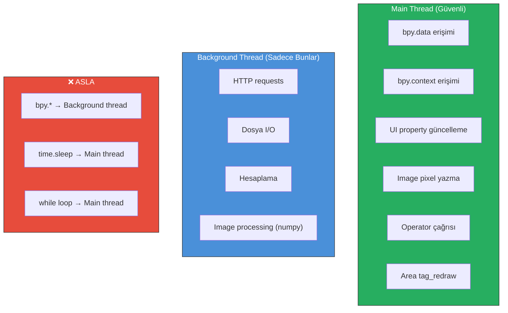

# 03 — Blender Entegrasyonu

> Blender 5.x API uyumu, Extensions Platform, threading modeli ve UI entegrasyonu.

---

## 3.1 Hedef Blender Sürümleri

### Sürüm Uyumluluk Matrisi

| Sürüm | Durum | Python | Destek Sonu | Notlar |
|:-------|:------|:-------|:-----------|:-------|
| **5.0** | ✅ Destekleniyor | 3.13 | Mart 2026 (EOL) | Minimum desteklenen sürüm |
| **5.1** | ✅ Destekleniyor | 3.13 | Temmuz 2026 (EOL) | Ara sürüm |
| **5.2 LTS** | ✅ **Birincil hedef** | 3.13 | **Temmuz 2028** | Önerilen sürüm |
| **5.3** | 🔄 Planlanıyor | 3.13+ | Kasım 2026+ | Test edilecek |

### Minimum Gereksinimler

```toml
# blender_manifest.toml
blender_version_min = "5.0.0"
```

---

## 3.2 Extensions Platform Entegrasyonu

### Manifest Dosyası

Blender 4.2+ ile tanıtılan Extensions Platform, 5.x serisinde standart dağıtım mekanizmasıdır. Eski `bl_info` sistemi deprecated durumdadır.

```toml
# blender_manifest.toml

schema_version = "1.0.0"

# Extension kimliği
id = "ai_texture_painter"
version = "0.1.0"
name = "AI Texture Painter"
tagline = "AI-powered texture editing directly in Blender"

# Geliştirici bilgisi
maintainer = "Inkbytefo <contact@inkbytefo.com>"

# Extension tipi
type = "add-on"

# Blender uyumluluk
blender_version_min = "5.0.0"

# Lisans (SPDX format, Blender gereksinimleri)
license = ["SPDX:GPL-3.0-or-later"]

# Kategoriler
tags = ["Paint", "Material", "UV"]

# Harici Python bağımlılıkları (wheel olarak)
wheels = [
    "wheels/httpx-0.27.0-py3-none-any.whl",
    "wheels/httpcore-1.0.5-py3-none-any.whl",
    "wheels/anyio-4.4.0-py3-none-any.whl",
    "wheels/certifi-2024.7.4-py3-none-any.whl",
    "wheels/h11-0.14.0-py3-none-any.whl",
    "wheels/idna-3.7-py3-none-any.whl",
    "wheels/sniffio-1.3.1-py3-none-any.whl",
]

# Permissions (kullanıcıya gösterilir)
[permissions]
network = "AI provider API'lerine HTTP istekleri göndermek için gerekli"
files = "Texture dosyalarını okuma/yazma ve cache yönetimi için gerekli"
```

### Eski bl_info vs Yeni Manifest

| Özellik | Eski (`bl_info`) | Yeni (`manifest.toml`) |
|:--------|:-----------------|:----------------------|
| Konum | `__init__.py` içinde | Ayrı dosya |
| Format | Python dict | TOML |
| Bağımlılıklar | Manuel yükleme | Wheel bundling |
| Dağıtım | Manuel ZIP | Extensions Platform |
| Güncelleme | Manuel | Otomatik |
| İzinler | Yok | Açık bildirim gerekli |

### Dizin Yapısı (Paketlenmiş)

```
ai_texture_painter.zip
├── blender_manifest.toml
├── __init__.py
├── core/
├── ai/
├── texture/
├── blender/
├── operators/
├── ui/
├── utils/
└── wheels/
    ├── httpx-0.27.0-py3-none-any.whl
    ├── httpcore-1.0.5-py3-none-any.whl
    └── ...
```

---

## 3.3 Blender 5.0 API Breaking Changes

Blender 5.0'da yapılan kritik API değişiklikleri ve addon'umuz üzerindeki etkileri:

### 3.3.1 Dict-like Property Erişimi Kaldırıldı

```python
# ❌ ESKİ YÖNTEM (5.0 öncesi) — Artık çalışmıyor
scene_prop = bpy.context.scene['my_property']

# ✅ YENİ YÖNTEM (5.0+) — Doğru kullanım
scene_prop = bpy.context.scene.my_property
```

**Etki**: Tüm custom property erişimleri `bpy.props` ile tanımlanmalı.

### 3.3.2 get_transform / set_transform

```python
# ✅ Yeni transform yöntemleri
obj.get_transform()
obj.set_transform(matrix)
```

### 3.3.3 READ_ONLY Properties

```python
# ✅ Read-only property tanımlama
my_prop: bpy.props.FloatProperty(
    name="Progress",
    get=lambda self: self._progress,
    options={'READ_ONLY'}
)
```

### 3.3.4 Private Modüller

Aşağıdaki modüller artık private:
- `bl_console_utils` → Kullanılmamalı
- `bl_rna_utils` → Kullanılmamalı

### 3.3.5 property_unset()

```python
# ❌ Eski
del obj['my_property']

# ✅ Yeni
obj.property_unset('my_property')
```

---

## 3.4 Threading Modeli

### Blender Thread Güvenliği

> **Kritik Kural**: Blender Python API (`bpy`) thread-safe **DEĞİLDİR**. `bpy` çağrıları sadece main thread'den yapılabilir.

### Önerilen Pattern: Thread + Timer

```python
import bpy
import threading
import numpy as np

class GenerationState:
    """Thread-safe state container"""
    def __init__(self):
        self.progress: float = 0.0
        self.finished: bool = False
        self.error: str | None = None
        self.result: np.ndarray | None = None
        self.message: str = "Hazırlanıyor..."
        self._lock = threading.Lock()
    
    def update(self, **kwargs):
        with self._lock:
            for key, value in kwargs.items():
                setattr(self, key, value)
    
    def get_status(self):
        with self._lock:
            return {
                'progress': self.progress,
                'finished': self.finished,
                'error': self.error,
                'message': self.message,
            }

# Global state instance
_generation_state = GenerationState()

def background_worker(request_data):
    """Background thread — AI generation"""
    try:
        _generation_state.update(message="AI provider'a bağlanılıyor...")
        
        # HTTP request (BPY KULLANILMAZ!)
        result = ai_provider.generate(request_data)
        
        _generation_state.update(
            result=result,
            finished=True,
            message="Tamamlandı"
        )
    except Exception as e:
        _generation_state.update(
            error=str(e),
            finished=True,
            message=f"Hata: {e}"
        )

def check_progress():
    """Main thread timer callback"""
    status = _generation_state.get_status()
    
    # UI property güncelleme (main thread'de güvenli)
    wm = bpy.context.window_manager
    wm.ai_texture_progress = status['progress']
    wm.ai_texture_status = status['message']
    
    if status['finished']:
        if status['error']:
            # Error handling
            bpy.ops.ai_texture.show_error('INVOKE_DEFAULT')
        else:
            # Result hazır — compositing başlat
            bpy.ops.ai_texture.apply_result('INVOKE_DEFAULT')
        return None  # Timer'ı durdur
    
    # UI'ı yeniden çiz
    for area in bpy.context.screen.areas:
        if area.type in ['IMAGE_EDITOR', 'VIEW_3D']:
            area.tag_redraw()
    
    return 0.1  # 100ms sonra tekrar kontrol et

# Başlatma
def start_generation(request):
    _generation_state.__init__()  # Reset
    thread = threading.Thread(
        target=background_worker,
        args=(request,),
        daemon=True
    )
    thread.start()
    bpy.app.timers.register(check_progress)
```

### Threading Kuralları Özeti



---

## 3.5 Blender API Kullanım Alanları

### 3.5.1 Image Editor

```python
# Aktif image'ı alma
def get_active_image(context):
    """Image Editor'daki aktif image'ı döndürür"""
    space = context.space_data
    if space and space.type == 'IMAGE_EDITOR':
        return space.image
    return None

# Image pixel okuma (NumPy)
def read_image_pixels(image):
    """Image pixel'lerini RGBA numpy array olarak okur"""
    import numpy as np
    width, height = image.size
    pixels = np.array(image.pixels[:])
    return pixels.reshape((height, width, 4))

# Image pixel yazma
def write_image_pixels(image, pixels_array):
    """Numpy array'den image pixel'lerini yazar"""
    image.pixels[:] = pixels_array.flatten()
    image.update()
```

### 3.5.2 UV Data

```python
import bmesh

def get_uv_data(obj):
    """Mesh'in UV koordinatlarını çıkarır"""
    me = obj.data
    bm = bmesh.new()
    bm.from_mesh(me)
    
    uv_layer = bm.loops.layers.uv.active
    if uv_layer is None:
        return None
    
    uv_data = []
    for face in bm.faces:
        face_uvs = []
        for loop in face.loops:
            uv = loop[uv_layer].uv
            face_uvs.append((uv.x, uv.y))
        uv_data.append({
            'face_index': face.index,
            'uvs': face_uvs,
            'selected': face.select,
        })
    
    bm.free()
    return uv_data
```

### 3.5.3 Texture Paint Mode

```python
def get_texture_paint_image(context):
    """Texture Paint mode'daki aktif image'ı bulur"""
    obj = context.active_object
    if obj and obj.mode == 'TEXTURE_PAINT':
        ts = context.tool_settings
        ip = ts.image_paint
        if ip and ip.canvas:
            return ip.canvas
    return None
```

### 3.5.4 Material & Shader Nodes

```python
def get_base_color_image(obj):
    """Objenin aktif material'ından Base Color image'ı bulur"""
    if not obj.active_material:
        return None
    
    mat = obj.active_material
    if not mat.use_nodes:
        return None
    
    nodes = mat.node_tree.nodes
    
    # Principled BSDF bul
    principled = None
    for node in nodes:
        if node.type == 'BSDF_PRINCIPLED':
            principled = node
            break
    
    if not principled:
        return None
    
    # Base Color input'una bağlı Image Texture bul
    base_color = principled.inputs['Base Color']
    if base_color.is_linked:
        from_node = base_color.links[0].from_node
        if from_node.type == 'TEX_IMAGE':
            return from_node.image
    
    return None
```

### 3.5.5 Selected Faces → UV Region

```python
def get_selected_faces_uv_bounds(obj):
    """Seçili face'lerin UV bounding box'ını hesaplar"""
    import bmesh
    
    bm = bmesh.from_edit_mesh(obj.data)
    uv_layer = bm.loops.layers.uv.active
    
    if not uv_layer:
        return None
    
    min_u, min_v = float('inf'), float('inf')
    max_u, max_v = float('-inf'), float('-inf')
    
    selected_faces = [f for f in bm.faces if f.select]
    
    if not selected_faces:
        return None
    
    for face in selected_faces:
        for loop in face.loops:
            uv = loop[uv_layer].uv
            min_u = min(min_u, uv.x)
            min_v = min(min_v, uv.y)
            max_u = max(max_u, uv.x)
            max_v = max(max_v, uv.y)
    
    return {
        'min_uv': (min_u, min_v),
        'max_uv': (max_u, max_v),
        'face_count': len(selected_faces),
    }
```

---

## 3.6 Viewport Güncelleme

```python
def force_viewport_update(context):
    """Texture değişikliğinden sonra viewport'u günceller"""
    # Image Editor'ı güncelle
    for area in context.screen.areas:
        if area.type == 'IMAGE_EDITOR':
            area.tag_redraw()
    
    # 3D Viewport'u güncelle
    for area in context.screen.areas:
        if area.type == 'VIEW_3D':
            area.tag_redraw()
    
    # Material viewport'ta güncellemesi için
    if context.active_object:
        obj = context.active_object
        if obj.active_material:
            obj.active_material.node_tree.update_tag()
```

---

## 3.7 Register / Unregister

```python
# __init__.py

# Blender 5.x Extensions — bl_info KULLANILMAZ
# Metadata blender_manifest.toml'da tanımlanır

import bpy
from . import operators, ui, core

# Tüm kayıt edilecek sınıflar
classes = [
    # Properties
    ui.properties.AITextureProperties,
    
    # Operators
    operators.generate.AITEXTURE_OT_generate,
    operators.fill.AITEXTURE_OT_fill,
    operators.remove.AITEXTURE_OT_remove,
    operators.apply.AITEXTURE_OT_apply,
    operators.apply.AITEXTURE_OT_cancel,
    operators.variation.AITEXTURE_OT_select_variation,
    
    # Panels
    ui.panels.AITEXTURE_PT_main_panel,
    ui.panels.AITEXTURE_PT_results_panel,
    ui.panels.AITEXTURE_PT_settings_panel,
]

def register():
    """Extension kayıt fonksiyonu"""
    for cls in classes:
        bpy.utils.register_class(cls)
    
    # Scene property group
    bpy.types.Scene.ai_texture = bpy.props.PointerProperty(
        type=ui.properties.AITextureProperties
    )
    
    # WindowManager progress properties
    bpy.types.WindowManager.ai_texture_progress = bpy.props.FloatProperty(
        name="Progress",
        default=0.0,
        min=0.0,
        max=1.0,
    )
    bpy.types.WindowManager.ai_texture_status = bpy.props.StringProperty(
        name="Status",
        default="Hazır",
    )
    
    # Provider registry başlat
    core.config.initialize()
    
    print("AI Texture Painter: Registered")

def unregister():
    """Extension kayıt silme fonksiyonu"""
    # Properties temizle
    del bpy.types.WindowManager.ai_texture_status
    del bpy.types.WindowManager.ai_texture_progress
    del bpy.types.Scene.ai_texture
    
    # Sınıfları ters sırada kaldır
    for cls in reversed(classes):
        bpy.utils.unregister_class(cls)
    
    print("AI Texture Painter: Unregistered")
```

---

## 3.8 Preferences

```python
class AITexturePreferences(bpy.types.AddonPreferences):
    bl_idname = "ai_texture_painter"
    
    # Provider ayarları
    active_provider: bpy.props.EnumProperty(
        name="AI Provider",
        items=[
            ('MOCK', "Mock (Test)", "Test provider"),
            ('OPENAI', "OpenAI", "OpenAI DALL-E"),
            ('FLUX', "Flux", "Flux via Replicate"),
            ('GEMINI', "Google Gemini", "Google Gemini"),
            ('LOCAL', "Local AI", "Local inference server"),
        ],
        default='MOCK',
    )
    
    # API Keys (güvenli saklama)
    openai_api_key: bpy.props.StringProperty(
        name="OpenAI API Key",
        subtype='PASSWORD',
    )
    
    flux_api_key: bpy.props.StringProperty(
        name="Flux API Key",
        subtype='PASSWORD',
    )
    
    gemini_api_key: bpy.props.StringProperty(
        name="Gemini API Key",
        subtype='PASSWORD',
    )
    
    local_server_url: bpy.props.StringProperty(
        name="Local Server URL",
        default="http://localhost:7860",
    )
    
    # Genel ayarlar
    default_variation_count: bpy.props.IntProperty(
        name="Default Variations",
        default=4,
        min=1,
        max=8,
    )
    
    cache_enabled: bpy.props.BoolProperty(
        name="Enable Cache",
        default=True,
    )
    
    log_level: bpy.props.EnumProperty(
        name="Log Level",
        items=[
            ('DEBUG', "Debug", ""),
            ('INFO', "Info", ""),
            ('WARNING', "Warning", ""),
            ('ERROR', "Error", ""),
        ],
        default='INFO',
    )
    
    def draw(self, context):
        layout = self.layout
        
        # Provider seçimi
        layout.prop(self, "active_provider")
        
        # Provider-specific ayarlar
        box = layout.box()
        box.label(text="API Ayarları", icon='LOCKED')
        
        provider = self.active_provider
        if provider == 'OPENAI':
            box.prop(self, "openai_api_key")
        elif provider == 'FLUX':
            box.prop(self, "flux_api_key")
        elif provider == 'GEMINI':
            box.prop(self, "gemini_api_key")
        elif provider == 'LOCAL':
            box.prop(self, "local_server_url")
        
        # Genel ayarlar
        box = layout.box()
        box.label(text="Genel Ayarlar", icon='PREFERENCES')
        box.prop(self, "default_variation_count")
        box.prop(self, "cache_enabled")
        box.prop(self, "log_level")
```

---

*Sonraki bölüm: [04 — AI Provider Sistemi](./04-AI_PROVIDER_SYSTEM.md)*
