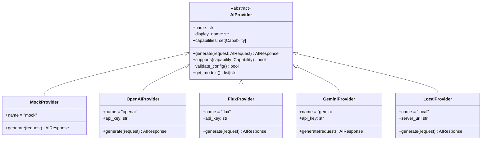
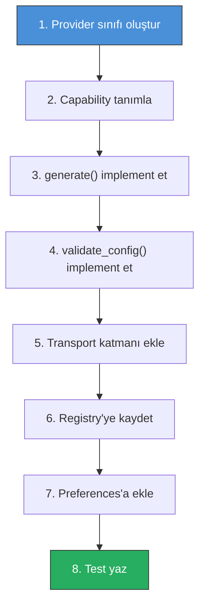

# 04 — AI Provider Sistemi

> Provider abstraction, capability sistemi, request/response modeli ve provider implementasyonları.

---

## 4.1 Tasarım Felsefesi

### Temel Kural

> **UI hiçbir AI provider'ın API'sini doğrudan çağırmamalıdır.**

UI sadece `Generate` der. Application layer `AIProvider.generate(request)` çağırır. Provider seçimi registry tarafından yapılır. Provider değiştirildiğinde UI kodu **değişmemelidir**.

### Provider Hiyerarşisi



---

## 4.2 Capability System

### Capability Enum

```python
from enum import Enum, auto

class Capability(Enum):
    """AI provider'ın desteklediği özellikler"""
    
    # Temel generation modları
    TEXT_TO_IMAGE = auto()       # Sadece prompt ile image üretme
    IMAGE_TO_IMAGE = auto()     # Var olan image'ı dönüştürme
    INPAINT = auto()            # Maskeli bölgeyi doldurma
    OUTPAINT = auto()           # Image sınırlarını genişletme
    
    # Ek özellikler
    REFERENCE_IMAGE = auto()    # Referans image ile yönlendirme
    VARIATIONS = auto()         # Çoklu sonuç üretimi
    UPSCALE = auto()            # Çözünürlük artırma
    SEAMLESS = auto()           # Seamless/tileable texture
    
    # Mask & kontrol
    MASK = auto()               # Mask desteği
    DEPTH_CONTROL = auto()      # Depth map ile kontrol
    NORMAL_CONTROL = auto()     # Normal map ile kontrol
    
    # Gelişmiş
    NEGATIVE_PROMPT = auto()    # Negatif prompt desteği
    SEED_CONTROL = auto()       # Seed ile tekrarlanabilirlik
    STRENGTH_CONTROL = auto()   # Denoising strength kontrolü
```

### Provider Capability Matrisi

| Capability | Mock | OpenAI | Flux | Gemini | Local |
|:-----------|:----:|:------:|:----:|:------:|:-----:|
| TEXT_TO_IMAGE | ✅ | ✅ | ✅ | ✅ | ✅ |
| IMAGE_TO_IMAGE | ✅ | ✅ | ✅ | ✅ | ✅ |
| INPAINT | ✅ | ✅ | ✅ | ✅ | ✅ |
| OUTPAINT | ❌ | ✅ | ✅ | ✅ | ⚙️ |
| REFERENCE_IMAGE | ✅ | ❌ | ✅ | ✅ | ⚙️ |
| VARIATIONS | ✅ | ✅ | ✅ | ✅ | ⚙️ |
| UPSCALE | ❌ | ❌ | ✅ | ❌ | ⚙️ |
| SEAMLESS | ❌ | ❌ | ⚙️ | ❌ | ⚙️ |
| MASK | ✅ | ✅ | ✅ | ✅ | ✅ |
| DEPTH_CONTROL | ❌ | ❌ | ⚙️ | ❌ | ⚙️ |
| NORMAL_CONTROL | ❌ | ❌ | ⚙️ | ❌ | ⚙️ |
| NEGATIVE_PROMPT | ✅ | ❌ | ✅ | ❌ | ✅ |
| SEED_CONTROL | ✅ | ❌ | ✅ | ❌ | ✅ |
| STRENGTH_CONTROL | ✅ | ❌ | ✅ | ❌ | ✅ |

> ⚙️ = Model/konfigürasyona bağlı

### UI Capability Binding

```python
def draw_panel(self, context):
    layout = self.layout
    props = context.scene.ai_texture
    provider = get_active_provider()
    
    # Prompt — her zaman göster
    layout.prop(props, "prompt")
    
    # Negative prompt — sadece destekleniyorsa
    if provider.supports(Capability.NEGATIVE_PROMPT):
        layout.prop(props, "negative_prompt")
    
    # Reference image — sadece destekleniyorsa
    if provider.supports(Capability.REFERENCE_IMAGE):
        layout.prop(props, "reference_image")
    
    # Seed — sadece destekleniyorsa
    if provider.supports(Capability.SEED_CONTROL):
        row = layout.row()
        row.prop(props, "seed")
        row.prop(props, "random_seed", toggle=True, icon='FILE_REFRESH')
    
    # Strength — sadece destekleniyorsa
    if provider.supports(Capability.STRENGTH_CONTROL):
        layout.prop(props, "strength", slider=True)
```

---

## 4.3 Request Model

### AIRequest

```python
from dataclasses import dataclass, field
from enum import Enum, auto
from typing import Optional
import numpy as np

class AIOperation(Enum):
    """AI işlem türleri"""
    GENERATE = auto()      # Yeni texture üret
    FILL = auto()          # Maskeli alanı doldur (inpaint)
    REMOVE = auto()        # Maskeli alanı kaldır
    EXPAND = auto()        # Texture genişlet (outpaint)
    UPSCALE = auto()       # Çözünürlük artır
    VARIATION = auto()     # Mevcut sonucun varyasyonunu üret

@dataclass
class AIContext:
    """3D context bilgisi (V2+ için)"""
    uv_map: Optional[np.ndarray] = None
    normal_map: Optional[np.ndarray] = None
    depth_map: Optional[np.ndarray] = None
    viewport_render: Optional[np.ndarray] = None
    selected_faces: Optional[list[int]] = None
    material_info: Optional[dict] = None

@dataclass
class AIRequest:
    """Standartlaştırılmış AI request"""
    
    # Zorunlu alanlar
    operation: AIOperation
    prompt: str
    width: int
    height: int
    
    # Opsiyonel alanlar
    negative_prompt: str = ""
    source_image: Optional[np.ndarray] = None    # RGBA numpy array
    mask: Optional[np.ndarray] = None             # Grayscale numpy array
    reference_images: list[np.ndarray] = field(default_factory=list)
    
    # Generation parametreleri
    seed: int = -1                  # -1 = random
    variation_count: int = 1        # Kaç sonuç üretilecek
    strength: float = 0.75          # Denoising strength (0-1)
    seamless: bool = False          # Seamless texture mi?
    preserve_unmasked: bool = True  # Mask dışı korunsun mu?
    
    # 3D context (V2+)
    context: Optional[AIContext] = None
    
    def validate(self) -> list[str]:
        """Request doğrulama"""
        errors = []
        
        if not self.prompt and self.operation != AIOperation.REMOVE:
            errors.append("Prompt gereklidir")
        
        if self.width <= 0 or self.height <= 0:
            errors.append("Geçersiz boyut")
        
        if self.operation in (AIOperation.FILL, AIOperation.REMOVE):
            if self.mask is None:
                errors.append("Bu işlem için mask gereklidir")
        
        if self.strength < 0 or self.strength > 1:
            errors.append("Strength 0-1 arasında olmalıdır")
        
        return errors
    
    def to_hash(self) -> str:
        """Cache key için request hash'i"""
        import hashlib
        
        hash_data = f"{self.operation.name}:{self.prompt}:{self.width}:{self.height}"
        hash_data += f":{self.seed}:{self.strength}"
        
        if self.source_image is not None:
            hash_data += f":{self.source_image.tobytes()[:1024]}"
        
        if self.mask is not None:
            hash_data += f":{self.mask.tobytes()[:1024]}"
        
        return hashlib.sha256(hash_data.encode()).hexdigest()[:16]
```

### AIResponse

```python
@dataclass
class AIResponse:
    """Standartlaştırılmış AI response"""
    
    success: bool
    images: list[np.ndarray]         # Üretilen image'lar (RGBA)
    
    # Metadata
    provider_name: str = ""
    model_name: str = ""
    generation_time: float = 0.0     # Saniye
    seed_used: int = -1
    
    # Error bilgisi
    error_message: str = ""
    error_code: str = ""
    
    # Provider-specific metadata
    metadata: dict = field(default_factory=dict)
    
    @property
    def variation_count(self) -> int:
        return len(self.images)
    
    @property
    def has_error(self) -> bool:
        return not self.success
    
    @staticmethod
    def error(message: str, code: str = "UNKNOWN") -> 'AIResponse':
        """Hata response'u oluştur"""
        return AIResponse(
            success=False,
            images=[],
            error_message=message,
            error_code=code,
        )
```

---

## 4.4 Provider Registry

```python
class ProviderRegistry:
    """AI provider merkezi kayıt sistemi"""
    
    _instance = None
    
    def __new__(cls):
        if cls._instance is None:
            cls._instance = super().__new__(cls)
            cls._instance._providers = {}
        return cls._instance
    
    def register(self, provider: AIProvider):
        """Provider kaydet"""
        self._providers[provider.name] = provider
    
    def get(self, name: str) -> AIProvider | None:
        """İsme göre provider al"""
        return self._providers.get(name)
    
    def get_active(self) -> AIProvider:
        """Aktif provider'ı al (preferences'tan)"""
        prefs = get_addon_preferences()
        name = prefs.active_provider.lower()
        provider = self.get(name)
        if provider is None:
            raise ValueError(f"Provider bulunamadı: {name}")
        return provider
    
    def list_providers(self) -> list[dict]:
        """Tüm kayıtlı provider'ları listele"""
        return [
            {
                'name': p.name,
                'display_name': p.display_name,
                'capabilities': [c.name for c in p.capabilities],
                'configured': p.validate_config(),
            }
            for p in self._providers.values()
        ]
    
    def get_providers_for_capability(
        self, capability: Capability
    ) -> list[AIProvider]:
        """Belirli capability'yi destekleyen provider'ları listele"""
        return [
            p for p in self._providers.values()
            if p.supports(capability)
        ]

# Global registry
registry = ProviderRegistry()
```

---

## 4.5 Provider Base Class

```python
from abc import ABC, abstractmethod

class AIProvider(ABC):
    """AI provider base class"""
    
    @property
    @abstractmethod
    def name(self) -> str:
        """Provider tekil ismi (lowercase)"""
        pass
    
    @property
    @abstractmethod
    def display_name(self) -> str:
        """UI'da gösterilecek isim"""
        pass
    
    @property
    @abstractmethod
    def capabilities(self) -> set[Capability]:
        """Desteklenen capability seti"""
        pass
    
    @abstractmethod
    def generate(self, request: AIRequest) -> AIResponse:
        """AI generation çalıştır"""
        pass
    
    @abstractmethod
    def validate_config(self) -> bool:
        """Konfigürasyon (API key vb.) geçerli mi?"""
        pass
    
    def supports(self, capability: Capability) -> bool:
        """Belirli capability destekleniyor mu?"""
        return capability in self.capabilities
    
    def get_models(self) -> list[str]:
        """Kullanılabilir model listesi"""
        return []
    
    def _validate_request(self, request: AIRequest) -> list[str]:
        """Request'i provider capability'lerine göre doğrula"""
        errors = request.validate()
        
        # Operation → capability eşleştirme
        op_cap_map = {
            AIOperation.GENERATE: Capability.TEXT_TO_IMAGE,
            AIOperation.FILL: Capability.INPAINT,
            AIOperation.REMOVE: Capability.INPAINT,
            AIOperation.EXPAND: Capability.OUTPAINT,
            AIOperation.UPSCALE: Capability.UPSCALE,
        }
        
        required_cap = op_cap_map.get(request.operation)
        if required_cap and not self.supports(required_cap):
            errors.append(
                f"{self.display_name} bu işlemi desteklemiyor: "
                f"{request.operation.name}"
            )
        
        if request.reference_images and not self.supports(
            Capability.REFERENCE_IMAGE
        ):
            errors.append(
                f"{self.display_name} referans image desteklemiyor"
            )
        
        return errors
```

---

## 4.6 Mock Provider

MVP geliştirmesinin kritik parçası. Gerçek AI kullanmadan tüm pipeline'ı test etmeyi sağlar.

```python
class MockProvider(AIProvider):
    """Test ve geliştirme için mock AI provider"""
    
    @property
    def name(self) -> str:
        return "mock"
    
    @property
    def display_name(self) -> str:
        return "Mock Provider (Test)"
    
    @property
    def capabilities(self) -> set[Capability]:
        return {
            Capability.TEXT_TO_IMAGE,
            Capability.IMAGE_TO_IMAGE,
            Capability.INPAINT,
            Capability.MASK,
            Capability.VARIATIONS,
            Capability.REFERENCE_IMAGE,
            Capability.NEGATIVE_PROMPT,
            Capability.SEED_CONTROL,
            Capability.STRENGTH_CONTROL,
        }
    
    def generate(self, request: AIRequest) -> AIResponse:
        """Mock generation — test pattern üretir"""
        import time
        import numpy as np
        
        # Simüle edilmiş gecikme
        time.sleep(0.5)
        
        images = []
        for i in range(request.variation_count):
            # Test pattern: renkli gradyan
            img = self._create_test_pattern(
                request.width,
                request.height,
                seed=request.seed + i if request.seed >= 0 else i,
            )
            
            # Mask varsa, sadece maskeli alanı değiştir
            if request.mask is not None and request.source_image is not None:
                mask_3d = np.stack([request.mask] * 4, axis=-1)
                img = (
                    request.source_image * (1 - mask_3d)
                    + img * mask_3d
                )
            
            images.append(img)
        
        return AIResponse(
            success=True,
            images=images,
            provider_name=self.name,
            model_name="mock-v1",
            generation_time=0.5,
            seed_used=request.seed,
        )
    
    def validate_config(self) -> bool:
        return True  # Mock her zaman geçerli
    
    def _create_test_pattern(
        self, width: int, height: int, seed: int = 0
    ) -> np.ndarray:
        """Test için renkli gradyan pattern üretir"""
        import numpy as np
        
        np.random.seed(seed)
        
        # Renkli gradyan
        x = np.linspace(0, 1, width)
        y = np.linspace(0, 1, height)
        xx, yy = np.meshgrid(x, y)
        
        r = (np.sin(xx * 6.28 + seed) + 1) / 2
        g = (np.sin(yy * 6.28 + seed * 2) + 1) / 2
        b = (np.sin((xx + yy) * 3.14 + seed * 3) + 1) / 2
        a = np.ones_like(r)
        
        return np.stack([r, g, b, a], axis=-1).astype(np.float32)
```

---

## 4.7 Provider Implementasyon Kılavuzu

### Yeni Provider Ekleme Adımları



### Checklist

```markdown
Yeni provider eklerken:

- [ ] `ai/providers/` altında yeni dosya oluştur
- [ ] `AIProvider` base class'ından türet
- [ ] `name`, `display_name`, `capabilities` tanımla
- [ ] `generate()` metodunu implement et
- [ ] `validate_config()` ile API key kontrolü
- [ ] HTTP transport için `ai/transport/http.py` kullan
- [ ] Request → Provider API format dönüşümü
- [ ] Provider API response → AIResponse dönüşümü
- [ ] Error handling (timeout, auth, rate limit)
- [ ] `__init__.py`'de registry'ye kayıt
- [ ] Preferences'a provider enum item ekle
- [ ] Unit test yaz
- [ ] Integration test yaz
```

---

## 4.8 Transport Katmanı

```python
# ai/transport/http.py

import httpx
import base64
import numpy as np
from typing import Optional

class AIHttpClient:
    """AI provider'lar için HTTP client"""
    
    def __init__(
        self,
        base_url: str,
        api_key: str = "",
        timeout: float = 120.0,  # 2 dakika default timeout
    ):
        self.base_url = base_url.rstrip('/')
        self.api_key = api_key
        self.timeout = timeout
    
    def post_json(
        self,
        endpoint: str,
        data: dict,
        headers: Optional[dict] = None,
    ) -> dict:
        """JSON POST request"""
        url = f"{self.base_url}/{endpoint.lstrip('/')}"
        
        default_headers = {
            'Content-Type': 'application/json',
        }
        if self.api_key:
            default_headers['Authorization'] = f'Bearer {self.api_key}'
        
        if headers:
            default_headers.update(headers)
        
        with httpx.Client(timeout=self.timeout) as client:
            response = client.post(
                url,
                json=data,
                headers=default_headers,
            )
            response.raise_for_status()
            return response.json()
    
    def post_multipart(
        self,
        endpoint: str,
        data: dict,
        files: dict,
        headers: Optional[dict] = None,
    ) -> dict:
        """Multipart POST request (image upload)"""
        url = f"{self.base_url}/{endpoint.lstrip('/')}"
        
        default_headers = {}
        if self.api_key:
            default_headers['Authorization'] = f'Bearer {self.api_key}'
        
        if headers:
            default_headers.update(headers)
        
        with httpx.Client(timeout=self.timeout) as client:
            response = client.post(
                url,
                data=data,
                files=files,
                headers=default_headers,
            )
            response.raise_for_status()
            return response.json()
    
    @staticmethod
    def numpy_to_base64_png(image: np.ndarray) -> str:
        """NumPy RGBA array → base64 PNG string"""
        from io import BytesIO
        # Pixel değerlerini 0-255'e dönüştür
        img_uint8 = (np.clip(image, 0, 1) * 255).astype(np.uint8)
        
        # PNG olarak encode et (PIL olmadan basit yöntem)
        # Gerçek implementasyonda PIL veya wand kullanılabilir
        buffer = BytesIO()
        # ... PNG encoding ...
        return base64.b64encode(buffer.getvalue()).decode('utf-8')
    
    @staticmethod
    def base64_png_to_numpy(b64_string: str) -> np.ndarray:
        """Base64 PNG string → NumPy RGBA array"""
        import base64
        from io import BytesIO
        
        img_bytes = base64.b64decode(b64_string)
        buffer = BytesIO(img_bytes)
        # ... PNG decoding ...
        # return np.ndarray (height, width, 4) float32
```

---

## 4.9 Error Handling

### Error Kodları

```python
class AIErrorCode:
    """Standart AI hata kodları"""
    
    # Konfigürasyon
    API_KEY_MISSING = "API_KEY_MISSING"
    API_KEY_INVALID = "API_KEY_INVALID"
    PROVIDER_NOT_FOUND = "PROVIDER_NOT_FOUND"
    
    # Network
    NETWORK_ERROR = "NETWORK_ERROR"
    TIMEOUT = "TIMEOUT"
    RATE_LIMIT = "RATE_LIMIT"
    
    # Provider
    PROVIDER_ERROR = "PROVIDER_ERROR"
    UNSUPPORTED_OPERATION = "UNSUPPORTED_OPERATION"
    INVALID_RESPONSE = "INVALID_RESPONSE"
    
    # Input
    INVALID_IMAGE_SIZE = "INVALID_IMAGE_SIZE"
    INVALID_MASK = "INVALID_MASK"
    CONTENT_POLICY = "CONTENT_POLICY"
    
    # Genel
    UNKNOWN = "UNKNOWN"
```

### Kullanıcıya Gösterilecek Mesajlar

```python
ERROR_MESSAGES = {
    "API_KEY_MISSING": "API anahtarı ayarlanmamış. Preferences → AI Texture Painter'dan ayarlayın.",
    "API_KEY_INVALID": "API anahtarı geçersiz. Lütfen kontrol edin.",
    "NETWORK_ERROR": "Ağ bağlantısı hatası. İnternet bağlantınızı kontrol edin.",
    "TIMEOUT": "İstek zaman aşımına uğradı. Tekrar deneyin.",
    "RATE_LIMIT": "İstek limiti aşıldı. Birkaç dakika sonra tekrar deneyin.",
    "CONTENT_POLICY": "İçerik politikası ihlali. Prompt'unuzu değiştirin.",
    "UNSUPPORTED_OPERATION": "Bu provider bu işlemi desteklemiyor.",
}
```

---

*Sonraki bölüm: [05 — Texture Pipeline](./05-TEXTURE_PIPELINE.md)*
