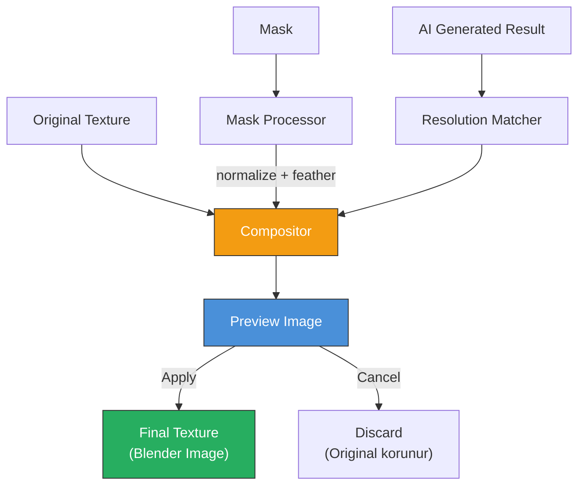
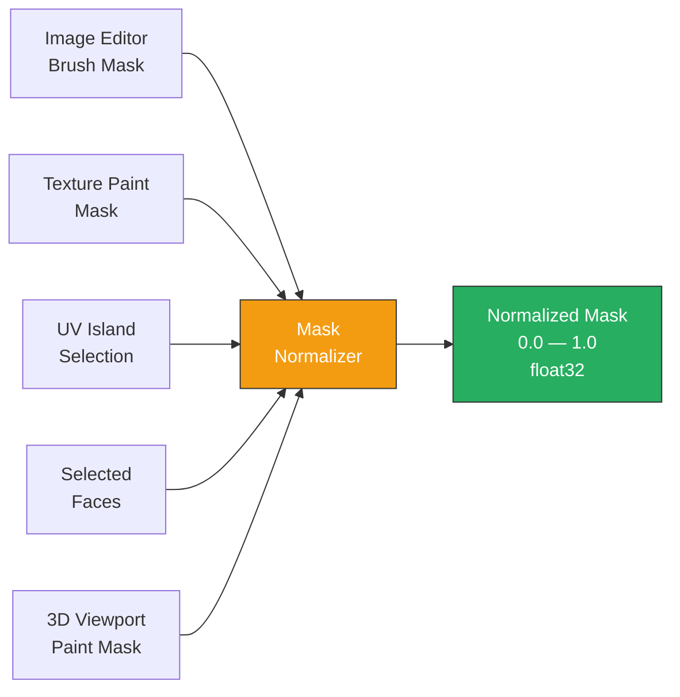
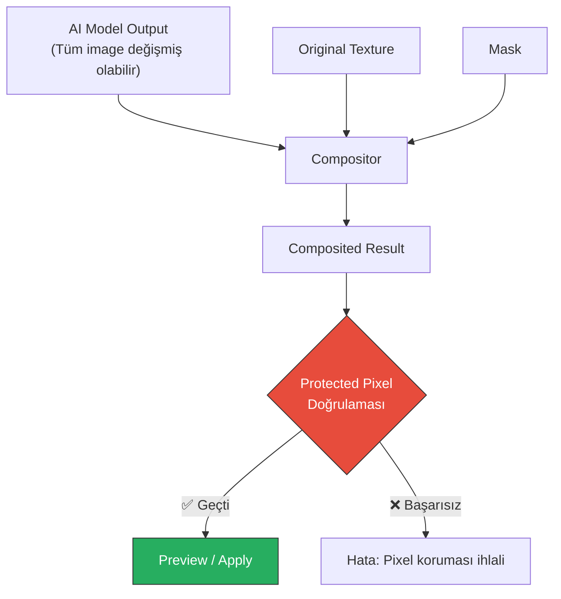
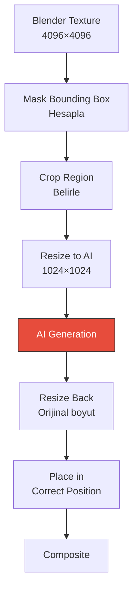
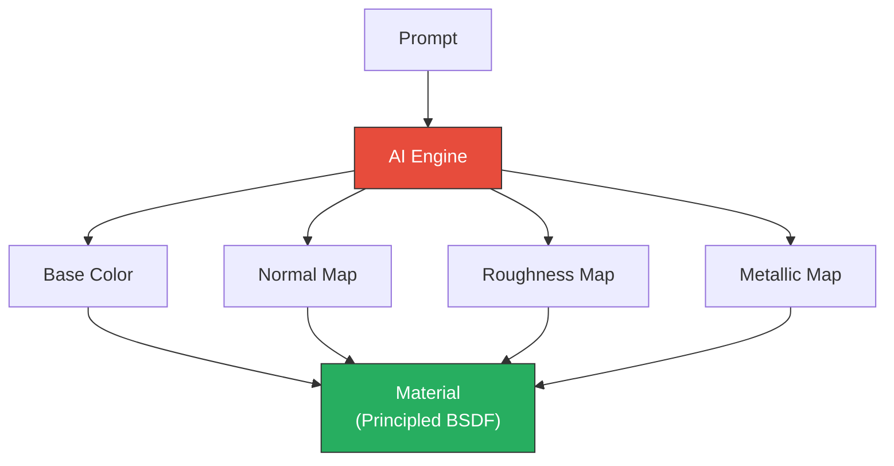

# 05 — Texture Pipeline

> Mask sistemi, compositing engine, resolution yönetimi, protected pixels ve PBR roadmap.

---

## 5.1 Pipeline Genel Bakış

### Texture Editing Pipeline



### Temel İlke

> Texture işlemleri **destructive olmamalıdır**. Orijinal texture her zaman geri dönülebilir durumda korunmalıdır.

---

## 5.2 Mask Sistemi

### Mask Standardı

Tüm mask'lar aşağıdaki standarda normalize edilir:

```
Format:    Grayscale (single channel)
Veri tipi: float32
Aralık:    0.0 — 1.0
Anlam:     0.0 = korunan (protected)
           1.0 = düzenlenebilir (editable)
Boyut:     Texture ile aynı çözünürlük
```

### Mask Kaynakları



### Mask Kaynak Implementasyonları

#### 1. Image Editor Brush Mask

```python
def extract_brush_mask(image_name: str) -> np.ndarray:
    """Image Editor'da boyanan mask'ı çıkarır"""
    img = bpy.data.images.get(image_name)
    if img is None:
        raise ValueError(f"Mask image bulunamadı: {image_name}")
    
    pixels = np.array(img.pixels[:])
    pixels = pixels.reshape((img.size[1], img.size[0], img.channels))
    
    # Grayscale'e dönüştür (ilk kanal veya ortalama)
    if img.channels >= 3:
        mask = np.mean(pixels[:, :, :3], axis=2)
    else:
        mask = pixels[:, :, 0]
    
    return mask.astype(np.float32)
```

#### 2. UV Island Selection

```python
def extract_uv_island_mask(
    obj, image_size: tuple[int, int]
) -> np.ndarray:
    """Seçili UV island'ların mask'ını oluşturur"""
    import bmesh
    from mathutils import Vector
    
    width, height = image_size
    mask = np.zeros((height, width), dtype=np.float32)
    
    bm = bmesh.from_edit_mesh(obj.data)
    uv_layer = bm.loops.layers.uv.active
    
    if not uv_layer:
        return mask
    
    for face in bm.faces:
        if not face.select:
            continue
        
        # Face'in UV koordinatlarını al
        uvs = [loop[uv_layer].uv for loop in face.loops]
        
        # UV koordinatlarını pixel koordinatlarına dönüştür
        pixel_coords = [
            (int(uv.x * width), int(uv.y * height))
            for uv in uvs
        ]
        
        # Face alanını mask'a doldur (rasterize)
        _fill_polygon(mask, pixel_coords, 1.0)
    
    return mask
```

#### 3. Selected Faces → Texture Mask

```python
def extract_face_selection_mask(
    obj, image_size: tuple[int, int]
) -> np.ndarray:
    """3D viewport'ta seçili face'lerin texture mask'ını oluşturur"""
    import bmesh
    
    width, height = image_size
    mask = np.zeros((height, width), dtype=np.float32)
    
    # Object mode'dan mesh verisi al
    me = obj.data
    bm = bmesh.new()
    bm.from_mesh(me)
    uv_layer = bm.loops.layers.uv.active
    
    if not uv_layer:
        bm.free()
        return mask
    
    for face in bm.faces:
        if not face.select:
            continue
        
        uvs = []
        for loop in face.loops:
            uv = loop[uv_layer].uv
            px = int(uv.x * width) % width
            py = int(uv.y * height) % height
            uvs.append((px, py))
        
        _fill_polygon(mask, uvs, 1.0)
    
    bm.free()
    return mask
```

### Mask İşlemleri

#### Feather / Softness

```python
def apply_feather(mask: np.ndarray, radius: int) -> np.ndarray:
    """Mask kenarlarına feather (yumuşatma) uygular"""
    from scipy.ndimage import gaussian_filter
    
    # Gaussian blur ile kenar yumuşatma
    feathered = gaussian_filter(mask, sigma=radius)
    
    return np.clip(feathered, 0.0, 1.0).astype(np.float32)
```

#### Invert

```python
def invert_mask(mask: np.ndarray) -> np.ndarray:
    """Mask'ı tersler"""
    return (1.0 - mask).astype(np.float32)
```

#### Threshold

```python
def threshold_mask(
    mask: np.ndarray, threshold: float = 0.5
) -> np.ndarray:
    """Mask'ı binary hale getirir"""
    return (mask >= threshold).astype(np.float32)
```

#### Dilate / Erode

```python
def dilate_mask(mask: np.ndarray, iterations: int = 1) -> np.ndarray:
    """Mask'ı genişletir"""
    from scipy.ndimage import binary_dilation
    binary = mask > 0.5
    dilated = binary_dilation(binary, iterations=iterations)
    return dilated.astype(np.float32)

def erode_mask(mask: np.ndarray, iterations: int = 1) -> np.ndarray:
    """Mask'ı daraltır"""
    from scipy.ndimage import binary_erosion
    binary = mask > 0.5
    eroded = binary_erosion(binary, iterations=iterations)
    return eroded.astype(np.float32)
```

---

## 5.3 Compositing Engine

### Temel Compositing Formülü

```
result[pixel] = original[pixel] × (1 − mask[pixel]) + generated[pixel] × mask[pixel]
```

### Implementasyon

```python
class TextureCompositor:
    """Mask-protected texture compositing"""
    
    @staticmethod
    def composite(
        original: np.ndarray,      # (H, W, 4) RGBA float32
        generated: np.ndarray,     # (H, W, 4) RGBA float32
        mask: np.ndarray,          # (H, W) float32 [0-1]
    ) -> np.ndarray:
        """
        Mask-protected compositing.
        Mask dışındaki pikseller HER ZAMAN orijinalden gelir.
        """
        # Mask'ı 4 kanala genişlet (RGBA)
        mask_4ch = np.stack([mask] * 4, axis=-1)
        
        # Compositing
        result = original * (1.0 - mask_4ch) + generated * mask_4ch
        
        return np.clip(result, 0.0, 1.0).astype(np.float32)
    
    @staticmethod
    def composite_with_feather(
        original: np.ndarray,
        generated: np.ndarray,
        mask: np.ndarray,
        feather_radius: int = 5,
    ) -> np.ndarray:
        """Feather'lı compositing"""
        from scipy.ndimage import gaussian_filter
        
        # Mask'a feather uygula
        feathered_mask = gaussian_filter(
            mask.astype(np.float64), sigma=feather_radius
        ).astype(np.float32)
        feathered_mask = np.clip(feathered_mask, 0.0, 1.0)
        
        # Compositing
        mask_4ch = np.stack([feathered_mask] * 4, axis=-1)
        result = original * (1.0 - mask_4ch) + generated * mask_4ch
        
        return np.clip(result, 0.0, 1.0).astype(np.float32)
    
    @staticmethod
    def verify_protected_pixels(
        original: np.ndarray,
        result: np.ndarray,
        mask: np.ndarray,
        tolerance: float = 1e-6,
    ) -> bool:
        """
        Protected pixel doğrulaması.
        Mask = 0 olan tüm piksellerin korunduğunu doğrular.
        """
        protected = mask < tolerance
        
        if not np.any(protected):
            return True  # Korunacak piksel yok
        
        original_protected = original[protected]
        result_protected = result[protected]
        
        return np.allclose(
            original_protected, result_protected, atol=tolerance
        )
```

### Protected Pixels Garantisi



> **Kritik Kural**: AI modeli tüm görüntüyü değiştirmiş olsa bile, final compositing sırasında mask dışı pikseller **her zaman** orijinal texture'dan alınır. Bu güvenlik katmanı provider'a **bırakılmamalıdır**.

---

## 5.4 Resolution Yönetimi

### Problem

```
Blender Texture: 4096 × 4096
AI Generation:   1024 × 1024
```

AI modelleri genellikle sabit veya sınırlı çözünürlükte çalışır, ancak texture çözünürlüğü çok daha yüksek olabilir.

### Çözüm Stratejisi



### Implementasyon

```python
class ResolutionManager:
    """Texture ve AI generation çözünürlük yönetimi"""
    
    # AI generation için desteklenen boyutlar
    SUPPORTED_SIZES = [512, 768, 1024, 1536, 2048]
    
    @staticmethod
    def get_mask_bounding_box(
        mask: np.ndarray, padding: int = 16
    ) -> tuple[int, int, int, int]:
        """Mask'ın bounding box'ını hesaplar (x, y, width, height)"""
        rows = np.any(mask > 0.01, axis=1)
        cols = np.any(mask > 0.01, axis=0)
        
        if not np.any(rows) or not np.any(cols):
            return (0, 0, mask.shape[1], mask.shape[0])
        
        rmin, rmax = np.where(rows)[0][[0, -1]]
        cmin, cmax = np.where(cols)[0][[0, -1]]
        
        # Padding ekle
        rmin = max(0, rmin - padding)
        rmax = min(mask.shape[0], rmax + padding)
        cmin = max(0, cmin - padding)
        cmax = min(mask.shape[1], cmax + padding)
        
        return (cmin, rmin, cmax - cmin, rmax - rmin)
    
    @staticmethod
    def find_best_generation_size(
        region_width: int, region_height: int
    ) -> tuple[int, int]:
        """En uygun AI generation boyutunu belirler"""
        max_dim = max(region_width, region_height)
        
        # En yakın desteklenen boyutu bul
        best_size = 1024  # default
        for size in ResolutionManager.SUPPORTED_SIZES:
            if size >= max_dim:
                best_size = size
                break
        else:
            best_size = ResolutionManager.SUPPORTED_SIZES[-1]
        
        return (best_size, best_size)
    
    @staticmethod
    def crop_region(
        image: np.ndarray, bbox: tuple[int, int, int, int]
    ) -> np.ndarray:
        """Image'dan bounding box bölgesini kırpar"""
        x, y, w, h = bbox
        return image[y:y+h, x:x+w].copy()
    
    @staticmethod
    def place_region(
        target: np.ndarray,
        region: np.ndarray,
        bbox: tuple[int, int, int, int],
    ) -> np.ndarray:
        """Küçük region'ı büyük image'ın doğru pozisyonuna yerleştirir"""
        x, y, w, h = bbox
        result = target.copy()
        
        # Resize gerekiyorsa
        if region.shape[0] != h or region.shape[1] != w:
            from skimage.transform import resize
            region = resize(region, (h, w, region.shape[2]))
        
        result[y:y+h, x:x+w] = region
        return result
```

---

## 5.5 Image Manager

```python
class ImageManager:
    """Blender image'ları ile çalışma"""
    
    @staticmethod
    def get_or_create_preview_image(
        name: str, width: int, height: int
    ) -> bpy.types.Image:
        """Preview image oluştur veya mevcut olanı al"""
        preview_name = f"_ai_preview_{name}"
        
        img = bpy.data.images.get(preview_name)
        if img is None:
            img = bpy.data.images.new(
                preview_name, width, height, alpha=True
            )
        elif img.size[0] != width or img.size[1] != height:
            img.scale(width, height)
        
        return img
    
    @staticmethod
    def backup_original(image_name: str) -> np.ndarray:
        """Orijinal texture'ı yedekle"""
        img = bpy.data.images[image_name]
        pixels = np.array(img.pixels[:])
        return pixels.reshape(
            (img.size[1], img.size[0], 4)
        ).copy()
    
    @staticmethod
    def update_image(image_name: str, pixels: np.ndarray):
        """Blender image'ını numpy array'den güncelle"""
        img = bpy.data.images[image_name]
        img.pixels[:] = pixels.flatten()
        img.update()
        
        # GPU texture'ını güncelle
        img.gl_free()
    
    @staticmethod
    def cleanup_preview_images():
        """Tüm preview image'ları temizle"""
        for img in list(bpy.data.images):
            if img.name.startswith("_ai_preview_"):
                bpy.data.images.remove(img)
```

---

## 5.6 Non-Destructive Workflow

### Mevcut Yapı (MVP)

```
Original Texture
      +
AI Layer (preview)
      +
Mask
      ↓
Composite
```

### Gelecek Yapı (V2+)

```
Texture
├── Original Layer
├── AI Generation 01 (mask + blend mode)
├── AI Generation 02 (mask + blend mode)
├── AI Remove (mask)
└── Manual Paint Layer
      ↓
Flattened Composite
      ↓
Blender Image
```

### Layer Veri Modeli (Gelecek)

```python
@dataclass
class TextureLayer:
    """Texture layer veri modeli"""
    name: str
    pixels: np.ndarray           # RGBA float32
    mask: np.ndarray             # Grayscale float32
    opacity: float = 1.0
    blend_mode: str = "NORMAL"   # NORMAL, MULTIPLY, OVERLAY, ...
    visible: bool = True
    locked: bool = False

@dataclass
class TextureStack:
    """Layer stack"""
    layers: list[TextureLayer]
    width: int
    height: int
    
    def flatten(self) -> np.ndarray:
        """Tüm layer'ları tek bir image'a birleştir"""
        result = np.zeros(
            (self.height, self.width, 4), dtype=np.float32
        )
        
        for layer in self.layers:
            if not layer.visible:
                continue
            
            mask = layer.mask * layer.opacity
            mask_4ch = np.stack([mask] * 4, axis=-1)
            
            if layer.blend_mode == "NORMAL":
                result = result * (1 - mask_4ch) + layer.pixels * mask_4ch
            # ... diğer blend mode'lar
        
        return result
```

---

## 5.7 History / Undo Sistemi

### State Stack

```python
@dataclass
class HistoryEntry:
    """Undo history girdisi"""
    label: str                    # "Leather generation", "Remove logo"
    pixels: np.ndarray            # Texture state snapshot
    timestamp: float              # time.time()
    operation: str                # FILL, REMOVE, GENERATE
    prompt: str                   # Kullanılan prompt

class HistoryManager:
    """Undo/redo yönetimi"""
    
    MAX_HISTORY = 20  # Memory limiti
    
    def __init__(self):
        self._stack: list[HistoryEntry] = []
        self._index: int = -1
    
    def push(self, entry: HistoryEntry):
        """Yeni state ekle"""
        # Mevcut index'ten sonraki tüm entry'leri sil (redo branch)
        self._stack = self._stack[:self._index + 1]
        
        # Memory limiti kontrol
        if len(self._stack) >= self.MAX_HISTORY:
            self._stack.pop(0)
        
        self._stack.append(entry)
        self._index = len(self._stack) - 1
    
    def undo(self) -> HistoryEntry | None:
        """Bir adım geri"""
        if self._index > 0:
            self._index -= 1
            return self._stack[self._index]
        return None
    
    def redo(self) -> HistoryEntry | None:
        """Bir adım ileri"""
        if self._index < len(self._stack) - 1:
            self._index += 1
            return self._stack[self._index]
        return None
    
    @property
    def can_undo(self) -> bool:
        return self._index > 0
    
    @property
    def can_redo(self) -> bool:
        return self._index < len(self._stack) - 1
    
    def get_memory_usage_mb(self) -> float:
        """Toplam memory kullanımı (MB)"""
        total_bytes = sum(
            entry.pixels.nbytes for entry in self._stack
        )
        return total_bytes / (1024 * 1024)
```

---

## 5.8 Seamless Texture Desteği

### Amaç

```
left edge ≈ right edge
top edge ≈ bottom edge
```

Texture tile edildiğinde görünür seam oluşmamalıdır.

### Yaklaşım (V2+)

```python
def prepare_seamless_request(
    image: np.ndarray
) -> np.ndarray:
    """Seamless generation için image'ı hazırlar"""
    h, w = image.shape[:2]
    
    # Image'ı tile ederek context oluştur
    tiled = np.tile(image, (3, 3, 1))
    
    # Merkez kısmı kırp (context ile birlikte)
    center = tiled[h:2*h, w:2*w]
    
    return center

def post_process_seamless(
    generated: np.ndarray,
    original: np.ndarray,
) -> np.ndarray:
    """Generation sonucunu seamless hale getir"""
    h, w = original.shape[:2]
    
    # Edge blending
    blend_width = w // 8
    
    # Horizontal seam düzeltme
    for i in range(blend_width):
        alpha = i / blend_width
        generated[:, i] = (
            generated[:, i] * alpha
            + generated[:, w - blend_width + i] * (1 - alpha)
        )
    
    return generated
```

---

## 5.9 PBR Texture Pipeline Roadmap

### MVP: Sadece Base Color

```
Prompt → AI → Base Color Texture
```

### V2: Multi-Channel Generation



### Desteklenecek PBR Kanalları

| Kanal | MVP | V2 | V3 |
|:------|:---:|:--:|:--:|
| Base Color | ✅ | ✅ | ✅ |
| Normal | ❌ | ✅ | ✅ |
| Roughness | ❌ | ✅ | ✅ |
| Metallic | ❌ | ❌ | ✅ |
| Height | ❌ | ❌ | ✅ |
| Ambient Occlusion | ❌ | ❌ | ✅ |
| Opacity | ❌ | ❌ | ✅ |
| Emission | ❌ | ❌ | ✅ |

### Normal Map Özel Kuralı

> Normal map işlemleri için AI output doğrudan normal map olarak **kabul edilmemelidir**.

Gelecekte:
```
AI generated height/detail
          ↓
Normal reconstruction
          ↓
Existing normal
          ↓
Normal blend
```

Mevcut normal map'in korunması önemlidir.

---

## 5.10 Cache Sistemi

```python
class GenerationCache:
    """AI generation sonuçlarını cache'ler"""
    
    def __init__(self, cache_dir: str, max_size_mb: int = 500):
        self.cache_dir = cache_dir
        self.max_size_mb = max_size_mb
    
    def get(self, request_hash: str) -> AIResponse | None:
        """Cache'den sonuç al"""
        cache_path = os.path.join(self.cache_dir, f"{request_hash}.npz")
        
        if not os.path.exists(cache_path):
            return None
        
        data = np.load(cache_path, allow_pickle=True)
        return AIResponse(
            success=True,
            images=[data[f'image_{i}'] for i in range(data['count'])],
            provider_name=str(data['provider']),
            model_name=str(data['model']),
        )
    
    def put(self, request_hash: str, response: AIResponse):
        """Sonucu cache'e yaz"""
        if not response.success:
            return
        
        cache_path = os.path.join(self.cache_dir, f"{request_hash}.npz")
        
        save_data = {
            'count': len(response.images),
            'provider': response.provider_name,
            'model': response.model_name,
        }
        
        for i, img in enumerate(response.images):
            save_data[f'image_{i}'] = img
        
        np.savez_compressed(cache_path, **save_data)
        self._cleanup_if_needed()
```

---

*Sonraki bölüm: [06 — Kullanıcı Deneyimi](./06-USER_EXPERIENCE.md)*
