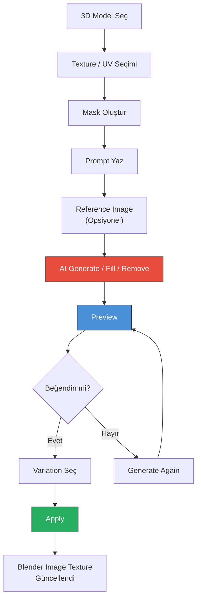
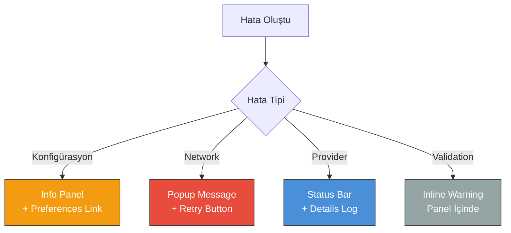

# 06 — Kullanıcı Deneyimi

> Kullanıcı akışları, UI tasarımı, error handling ve erişilebilirlik.

---

## 6.1 Ana Workflow

### Temel Kullanıcı Akışı



### Kullanıcı Akışı Detayları

| Adım | Kullanıcı Eylemi | Sistem Tepkisi |
|:-----|:-----------------|:---------------|
| 1 | 3D model seçer | Active object belirlenir |
| 2 | Image Editor'da texture açar | Aktif image tespit edilir |
| 3 | Brush ile mask boyar | Mask data hazırlanır |
| 4 | AI Texture Painter panelini açar | Panel N-panel'de görünür |
| 5 | Operation seçer (Fill/Remove/Generate) | UI uygun alanları gösterir |
| 6 | Prompt yazar | — |
| 7 | (Opsiyonel) Reference image ekler | Reference conditioning hazırlanır |
| 8 | Generate tıklar | Background generation başlar |
| 9 | Progress bar izler | %0 → %100 animasyonu |
| 10 | Sonuçları inceler | Variation grid gösterilir |
| 11 | Bir variation seçer | Preview güncellenir |
| 12 | Apply tıklar | Texture kalıcı olarak güncellenir |

---

## 6.2 UI Tasarımı

### Ana Panel (Image Editor N-Panel)

```
┌─────────────────────────────────────┐
│  AI TEXTURE PAINTER            [⚙️] │
├─────────────────────────────────────┤
│                                     │
│  Operation:                         │
│  ┌─────────────────────────────┐    │
│  │ ● Fill  ○ Remove  ○ Generate│    │
│  └─────────────────────────────┘    │
│                                     │
│  Prompt:                            │
│  ┌─────────────────────────────┐    │
│  │ worn black leather grip,    │    │
│  │ realistic rough surface     │    │
│  └─────────────────────────────┘    │
│                                     │
│  Negative Prompt:                   │
│  ┌─────────────────────────────┐    │
│  │ blurry, smooth, plastic     │    │
│  └─────────────────────────────┘    │
│                                     │
│  Reference:                         │
│  ┌─────────────────┐               │
│  │  [+ Add Image]  │               │
│  └─────────────────┘               │
│                                     │
│  Mask:                              │
│  ┌─────────────────────────────┐    │
│  │ ✅ Current Mask Detected     │    │
│  │    Coverage: 23%             │    │
│  └─────────────────────────────┘    │
│                                     │
│  Settings:                          │
│  Provider: [ Flux           ▼ ]     │
│  Model:    [ flux-pro       ▼ ]     │
│  Strength: [========●==] 0.75       │
│  Seed:     [ -1 (Random)    ]  🔄   │
│  Variations: [ 4 ]                  │
│  Feather:    [ 5 ] px               │
│                                     │
│  ┌─────────────────────────────┐    │
│  │         🚀 GENERATE          │    │
│  └─────────────────────────────┘    │
│                                     │
├─────────────────────────────────────┤
│  RESULTS                            │
│                                     │
│  ┌──────┐ ┌──────┐                 │
│  │  V1  │ │  V2  │                 │
│  │ [✓]  │ │      │                 │
│  └──────┘ └──────┘                 │
│  ┌──────┐ ┌──────┐                 │
│  │  V3  │ │  V4  │                 │
│  │      │ │      │                 │
│  └──────┘ └──────┘                 │
│                                     │
│  ┌────────────┐ ┌────────────┐     │
│  │   ✅ APPLY  │ │  ❌ CANCEL  │     │
│  └────────────┘ └────────────┘     │
│                                     │
│  ┌─────────────────────────────┐    │
│  │      🔄 GENERATE AGAIN      │    │
│  └─────────────────────────────┘    │
│                                     │
└─────────────────────────────────────┘
```

### Panel Kodu

```python
class AITEXTURE_PT_main_panel(bpy.types.Panel):
    """Ana AI Texture Painter paneli"""
    bl_label = "AI Texture Painter"
    bl_idname = "AITEXTURE_PT_main_panel"
    bl_space_type = 'IMAGE_EDITOR'
    bl_region_type = 'UI'
    bl_category = "AI Texture"
    
    def draw(self, context):
        layout = self.layout
        props = context.scene.ai_texture
        wm = context.window_manager
        provider = get_active_provider()
        
        # ── STATUS BAR ──
        if wm.ai_texture_status != "Hazır":
            box = layout.box()
            row = box.row()
            row.label(text=wm.ai_texture_status, icon='INFO')
            row = box.row()
            row.prop(wm, "ai_texture_progress", text="")
        
        # ── OPERATION ──
        layout.label(text="Operation:", icon='BRUSH_DATA')
        row = layout.row(align=True)
        row.prop(props, "operation", expand=True)
        
        # ── PROMPT ──
        layout.separator()
        layout.label(text="Prompt:", icon='TEXT')
        layout.prop(props, "prompt", text="")
        
        # Negative prompt (capability check)
        if provider.supports(Capability.NEGATIVE_PROMPT):
            layout.prop(props, "negative_prompt", text="Negative")
        
        # ── REFERENCE IMAGE ──
        if provider.supports(Capability.REFERENCE_IMAGE):
            layout.separator()
            layout.label(text="Reference:", icon='IMAGE_DATA')
            layout.template_ID(props, "reference_image",
                             open="image.open")
        
        # ── MASK STATUS ──
        layout.separator()
        box = layout.box()
        mask_status = check_mask_status(context)
        if mask_status['has_mask']:
            box.label(
                text=f"✅ Mask Detected ({mask_status['coverage']:.0%})",
                icon='CHECKMARK'
            )
        else:
            box.label(
                text="⚠️ No mask — paint one first",
                icon='ERROR'
            )
        
        # ── GENERATE BUTTON ──
        layout.separator()
        generate_row = layout.row()
        generate_row.scale_y = 1.5
        generate_row.operator(
            "ai_texture.generate",
            text="GENERATE",
            icon='PLAY'
        )
        generate_row.enabled = mask_status['has_mask']


class AITEXTURE_PT_results_panel(bpy.types.Panel):
    """Sonuçlar paneli"""
    bl_label = "Results"
    bl_idname = "AITEXTURE_PT_results_panel"
    bl_space_type = 'IMAGE_EDITOR'
    bl_region_type = 'UI'
    bl_category = "AI Texture"
    bl_parent_id = "AITEXTURE_PT_main_panel"
    
    @classmethod
    def poll(cls, context):
        """Sadece sonuç varsa göster"""
        return has_generation_results(context)
    
    def draw(self, context):
        layout = self.layout
        props = context.scene.ai_texture
        
        # ── VARIATION GRID ──
        grid = layout.grid_flow(
            row_major=True, columns=2, even_columns=True
        )
        for i in range(props.variation_count):
            col = grid.column()
            op = col.operator(
                "ai_texture.select_variation",
                text=f"V{i+1}",
                depress=(i == props.selected_variation),
            )
            op.variation_index = i
        
        # ── APPLY / CANCEL ──
        layout.separator()
        row = layout.row(align=True)
        row.scale_y = 1.3
        row.operator(
            "ai_texture.apply",
            text="APPLY",
            icon='CHECKMARK'
        )
        row.operator(
            "ai_texture.cancel",
            text="CANCEL",
            icon='CANCEL'
        )
        
        # ── GENERATE AGAIN ──
        layout.operator(
            "ai_texture.generate",
            text="Generate Again",
            icon='FILE_REFRESH'
        )


class AITEXTURE_PT_settings_panel(bpy.types.Panel):
    """Ayarlar paneli"""
    bl_label = "Settings"
    bl_idname = "AITEXTURE_PT_settings_panel"
    bl_space_type = 'IMAGE_EDITOR'
    bl_region_type = 'UI'
    bl_category = "AI Texture"
    bl_parent_id = "AITEXTURE_PT_main_panel"
    bl_options = {'DEFAULT_CLOSED'}
    
    def draw(self, context):
        layout = self.layout
        props = context.scene.ai_texture
        provider = get_active_provider()
        
        layout.prop(props, "provider_enum", text="Provider")
        
        if provider.supports(Capability.STRENGTH_CONTROL):
            layout.prop(props, "strength", slider=True)
        
        if provider.supports(Capability.SEED_CONTROL):
            row = layout.row()
            row.prop(props, "seed")
            row.prop(props, "random_seed", toggle=True,
                    icon='FILE_REFRESH', text="")
        
        layout.prop(props, "variation_count")
        layout.prop(props, "feather_radius")
```

---

## 6.3 Properties

```python
class AITextureProperties(bpy.types.PropertyGroup):
    """Addon custom properties"""
    
    operation: bpy.props.EnumProperty(
        name="Operation",
        items=[
            ('FILL', "Fill", "AI ile maskeli alanı doldur", 'BRUSH_DATA', 0),
            ('REMOVE', "Remove", "Maskeli alanı kaldır", 'BRUSH_SOFTEN', 1),
            ('GENERATE', "Generate", "Yeni texture üret", 'ADD', 2),
        ],
        default='FILL',
    )
    
    prompt: bpy.props.StringProperty(
        name="Prompt",
        description="AI'ya ne üretmesini istediğinizi yazın",
        default="",
        maxlen=2000,
    )
    
    negative_prompt: bpy.props.StringProperty(
        name="Negative Prompt",
        description="İstemediğiniz özellikleri yazın",
        default="",
        maxlen=500,
    )
    
    reference_image: bpy.props.PointerProperty(
        name="Reference Image",
        type=bpy.types.Image,
        description="Referans görsel (opsiyonel)",
    )
    
    provider_enum: bpy.props.EnumProperty(
        name="Provider",
        items=get_provider_enum_items,
    )
    
    strength: bpy.props.FloatProperty(
        name="Strength",
        description="AI değişiklik gücü (0=az, 1=tam)",
        default=0.75,
        min=0.0,
        max=1.0,
        step=5,
    )
    
    seed: bpy.props.IntProperty(
        name="Seed",
        description="-1 = random",
        default=-1,
        min=-1,
    )
    
    random_seed: bpy.props.BoolProperty(
        name="Random Seed",
        default=True,
    )
    
    variation_count: bpy.props.IntProperty(
        name="Variations",
        description="Kaç farklı sonuç üretilecek",
        default=4,
        min=1,
        max=8,
    )
    
    selected_variation: bpy.props.IntProperty(
        name="Selected Variation",
        default=0,
        min=0,
    )
    
    feather_radius: bpy.props.IntProperty(
        name="Feather",
        description="Mask kenar yumuşatma (px)",
        default=5,
        min=0,
        max=50,
    )
```

---

## 6.4 Error Handling UX

### Error Gösterim Stratejisi



### Hata Mesajları

| Durum | Kullanıcı Mesajı | Aksiyon |
|:------|:-----------------|:--------|
| API key eksik | "API anahtarı ayarlanmamış" | → Preferences link |
| API key geçersiz | "API anahtarı geçersiz" | → Preferences link |
| Network hatası | "Bağlantı hatası" | → Retry butonu |
| Timeout | "İstek zaman aşımına uğradı" | → Retry butonu |
| Rate limit | "İstek limiti aşıldı" | → Bekle + Retry |
| Content policy | "İçerik politikası ihlali" | → Prompt değiştir |
| Mask yok | "Önce mask oluşturun" | → Brush seçimi |
| Image yok | "Aktif texture bulunamadı" | → Image seçimi |

### Error Popup

```python
class AITEXTURE_OT_show_error(bpy.types.Operator):
    bl_idname = "ai_texture.show_error"
    bl_label = "AI Texture Error"
    
    message: bpy.props.StringProperty()
    error_code: bpy.props.StringProperty()
    
    def execute(self, context):
        return {'FINISHED'}
    
    def invoke(self, context, event):
        return context.window_manager.invoke_props_dialog(
            self, width=400
        )
    
    def draw(self, context):
        layout = self.layout
        
        # Error icon ve mesaj
        col = layout.column()
        col.label(text="Generation Failed", icon='ERROR')
        col.separator()
        col.label(text=self.message)
        
        # Hata koduna göre ek bilgi
        if self.error_code == "API_KEY_MISSING":
            col.separator()
            col.operator(
                "screen.userpref_show",
                text="Open Preferences",
                icon='PREFERENCES'
            )
        
        # Retry butonu
        col.separator()
        col.operator(
            "ai_texture.generate",
            text="Retry",
            icon='FILE_REFRESH'
        )
```

---

## 6.5 Progress Gösterimi

### Progress Bar

```python
def draw_progress(self, context):
    """Progress bar çizimi"""
    layout = self.layout
    wm = context.window_manager
    
    if wm.ai_texture_progress > 0 and wm.ai_texture_progress < 1:
        box = layout.box()
        
        # Status mesajı
        row = box.row()
        row.label(text=wm.ai_texture_status, icon='TIME')
        
        # Progress bar
        row = box.row()
        row.prop(
            wm, "ai_texture_progress",
            text="",
            slider=True,
        )
        
        # Cancel butonu
        row = box.row()
        row.operator(
            "ai_texture.cancel_generation",
            text="Cancel",
            icon='CANCEL'
        )
```

### Progress Durumları

```
[░░░░░░░░░░]  0%  — Hazırlanıyor...
[██░░░░░░░░] 20%  — Mask işleniyor...
[████░░░░░░] 40%  — AI provider'a gönderiliyor...
[██████░░░░] 60%  — Generation devam ediyor...
[████████░░] 80%  — Sonuç alınıyor...
[█████████░] 90%  — Compositing...
[██████████] 100% — Tamamlandı!
```

---

## 6.6 Keyboard Shortcuts

| Kısayol | Eylem | Bağlam |
|:--------|:------|:-------|
| `Ctrl+Shift+G` | Generate | Panel aktifken |
| `Ctrl+Shift+A` | Apply | Sonuç varken |
| `Escape` | Cancel | Generation/Preview sırasında |
| `1-8` | Variation seçimi | Sonuç paneli açıkken |
| `Ctrl+Z` | Undo | Her zaman |
| `Ctrl+Shift+Z` | Redo | Her zaman |

---

## 6.7 Context Menüsü

```python
def image_editor_context_menu(self, context):
    """Image Editor context menüsüne ekleme"""
    layout = self.layout
    layout.separator()
    layout.label(text="AI Texture", icon='BRUSH_DATA')
    layout.operator("ai_texture.fill", text="AI Fill")
    layout.operator("ai_texture.remove", text="AI Remove")
    layout.operator("ai_texture.generate", text="AI Generate")
```

---

*Sonraki bölüm: [07 — Yol Haritası](./07-ROADMAP.md)*
