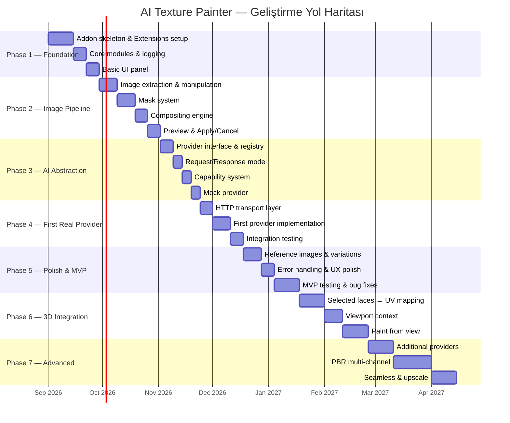
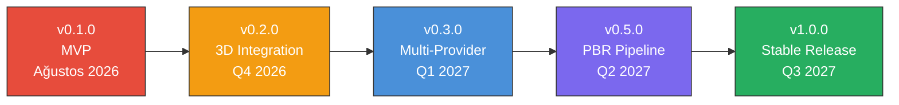

# 07 — Yol Haritası (Roadmap)

> Detaylı geliştirme fazları, milestone'lar, tahmini süreler ve MVP tanımı.

---

## 7.1 Genel Zaman Çizelgesi



---

## 7.2 Detaylı Faz Planı

### Phase 1 — Foundation (4 hafta)

**Hedef**: Çalışan bir Blender extension skeleton'ı, aktif edilebildiğinde paneli gösteren temel yapı.

| Görev | Açıklama | Tahmini Süre | Öncelik |
|:------|:---------|:------------|:--------|
| Extension skeleton | `blender_manifest.toml` + `__init__.py` + `register/unregister` | 3 gün | 🔴 Kritik |
| Dizin yapısı | Tüm modül dizinlerinin oluşturulması | 1 gün | 🔴 Kritik |
| Core: config | Konfigürasyon yönetimi modülü | 2 gün | 🔴 Kritik |
| Core: logging | Structured logging sistemi | 2 gün | 🟡 Yüksek |
| Core: state | Global state management | 2 gün | 🟡 Yüksek |
| Preferences | Addon preferences paneli | 2 gün | 🟡 Yüksek |
| Basic panel | Image Editor N-panel (boş) | 2 gün | 🔴 Kritik |
| Properties | Custom property group tanımları | 2 gün | 🟡 Yüksek |
| Git setup | `.gitignore`, branch strategy | 1 gün | 🟡 Yüksek |

**Milestone 1 Kriteri**:
```
✅ Blender 5.2'de extension aktif edilebiliyor
✅ AI Texture Painter paneli Image Editor'da görünüyor
✅ Preferences paneli açılıyor
✅ Structured log çıktısı alınabiliyor
```

---

### Phase 2 — Image Pipeline (5 hafta)

**Hedef**: Blender image'ları okunabiliyor, mask çıkarılabiliyor, compositing yapılabiliyor, preview gösterilebiliyor.

| Görev | Açıklama | Tahmini Süre | Öncelik |
|:------|:---------|:------------|:--------|
| Blender image adapter | `bpy.types.Image` wrapper (numpy) | 3 gün | 🔴 Kritik |
| Image detection | Aktif image otomatik tespiti | 2 gün | 🔴 Kritik |
| Mask: brush extraction | Image Editor brush mask çıkarma | 3 gün | 🔴 Kritik |
| Mask: normalization | Farklı kaynaklardan mask standardizasyonu | 2 gün | 🔴 Kritik |
| Mask: feather | Mask kenar yumuşatma | 2 gün | 🟡 Yüksek |
| Compositor | Mask-protected pixel compositing | 3 gün | 🔴 Kritik |
| Protected pixel guarantee | Mask dışı piksel korunma doğrulaması | 2 gün | 🔴 Kritik |
| Resolution manager | Texture vs AI resolution yönetimi | 3 gün | 🟡 Yüksek |
| Preview image | Preview image oluşturma/gösterme | 2 gün | 🔴 Kritik |
| Apply/Cancel | Apply ve cancel workflow'u | 3 gün | 🔴 Kritik |
| Image backup | Orijinal texture yedekleme | 1 gün | 🔴 Kritik |
| Viewport update | Material viewport güncelleme | 2 gün | 🟡 Yüksek |

**Milestone 2 Kriteri**:
```
✅ Image Editor'da aktif texture otomatik tespit ediliyor
✅ Brush ile boyanan mask doğru şekilde çıkarılıyor
✅ Bir test image, mask ile doğru şekilde composit ediliyor
✅ Mask dışı pikseller %100 korunuyor
✅ Preview image gösterilebiliyor
✅ Apply ile texture güncellenebiliyor
✅ Cancel ile orijinale dönülebiliyor
```

---

### Phase 3 — AI Abstraction (3 hafta)

**Hedef**: Provider interface, request/response modeli, capability sistemi ve Mock Provider çalışıyor.

| Görev | Açıklama | Tahmini Süre | Öncelik |
|:------|:---------|:------------|:--------|
| AIProvider base class | Abstract base class tanımı | 2 gün | 🔴 Kritik |
| Capability enum | Tüm capability'lerin tanımı | 1 gün | 🔴 Kritik |
| AIRequest model | Request dataclass | 2 gün | 🔴 Kritik |
| AIResponse model | Response dataclass | 1 gün | 🔴 Kritik |
| Provider registry | Singleton registry | 2 gün | 🔴 Kritik |
| Mock provider | Test pattern üreten provider | 3 gün | 🔴 Kritik |
| Request validation | Capability-based validation | 2 gün | 🟡 Yüksek |
| Capability UI binding | UI'da capability kontrolü | 2 gün | 🟡 Yüksek |

> **Önemli**: Gerçek AI provider bağlamadan önce MockProvider oluşturulmalıdır. Böylece UI ve texture pipeline API olmadan test edilebilir.

**Milestone 3 Kriteri**:
```
✅ MockProvider ile fake generation yapılabiliyor
✅ UI'da desteklenmeyen özellikler otomatik gizleniyor
✅ Request validation çalışıyor
✅ Tüm pipeline Mock ile uçtan uca çalışıyor:
   Mask → MockProvider → Composite → Preview → Apply
```

---

### Phase 4 — First Real Provider (3 hafta)

**Hedef**: En az bir gerçek AI provider (Flux veya OpenAI) ile çalışan generation.

| Görev | Açıklama | Tahmini Süre | Öncelik |
|:------|:---------|:------------|:--------|
| HTTP transport | httpx tabanlı async HTTP client | 3 gün | 🔴 Kritik |
| Wheel bundling | httpx + bağımlılıkları .whl olarak paketleme | 2 gün | 🔴 Kritik |
| Threading | Background generation + timer polling | 3 gün | 🔴 Kritik |
| Progress reporting | UI progress bar | 2 gün | 🟡 Yüksek |
| Provider impl | İlk gerçek provider (Flux veya OpenAI) | 5 gün | 🔴 Kritik |
| Error handling | Timeout, auth, network hataları | 3 gün | 🟡 Yüksek |
| Integration test | Gerçek API ile test | 3 gün | 🟡 Yüksek |

**Milestone 4 Kriteri**:
```
✅ Gerçek AI provider ile texture generation çalışıyor
✅ Generation sırasında Blender UI donmuyor
✅ Progress bar güncellenıyor
✅ Hata durumları kullanıcıya gösteriliyor
✅ API key preferences'tan okunuyor
```

---

### Phase 5 — Polish & MVP Release (5 hafta)

**Hedef**: Reference image, variations, UX cilalama ve MVP sürüm.

| Görev | Açıklama | Tahmini Süre | Öncelik |
|:------|:---------|:------------|:--------|
| Reference image | Referans görsel conditioning | 3 gün | 🟡 Yüksek |
| Variation system | Çoklu sonuç üretimi | 3 gün | 🔴 Kritik |
| Variation UI | Grid görünümü ve seçim | 3 gün | 🔴 Kritik |
| History/Undo | State stack yönetimi | 3 gün | 🟡 Yüksek |
| Cache system | Request hash tabanlı cache | 3 gün | 🟢 Normal |
| Error UX | Kullanıcı dostu hata gösterimi | 2 gün | 🟡 Yüksek |
| Second provider | İkinci AI provider implementasyonu | 5 gün | 🟢 Normal |
| MVP testing | Kapsamlı test + bug fix | 10 gün | 🔴 Kritik |
| Documentation | Kullanıcı kılavuzu | 3 gün | 🟡 Yüksek |

**🎯 MVP RELEASE Kriteri**:
```
✅ 1. Blender açılır
✅ 2. Addon aktif edilir
✅ 3. Image Editor'da texture açılır
✅ 4. Kullanıcı mask oluşturur
✅ 5. AI Texture Painter paneli açılır
✅ 6. Prompt girilir
✅ 7. Generate tıklanır
✅ 8. Provider request oluşturulur
✅ 9. Result alınır
✅ 10. Result preview edilir
✅ 11. Mask dışındaki orijinal pikseller korunur
✅ 12. Kullanıcı Apply der
✅ 13. Blender texture güncellenir
✅ 14. Material viewport'ta güncellenir
✅ 15. Undo mümkün olur
```

---

### Phase 6 — 3D Integration (6 hafta)

**Hedef**: 3D viewport'tan face seçimi → UV mapping → texture generation.

| Görev | Açıklama | Tahmini Süre | Öncelik |
|:------|:---------|:------------|:--------|
| Selected faces detection | 3D viewport'ta seçili face'leri algılama | 3 gün | 🟡 Yüksek |
| UV extraction | Seçili face'lerin UV koordinatlarını çıkarma | 5 gün | 🟡 Yüksek |
| Face → UV mask | Face seçiminden texture mask oluşturma | 5 gün | 🟡 Yüksek |
| Viewport context | Camera view render, depth, normal | 7 gün | 🟢 Normal |
| Texture region mapping | UV bounding box → texture region | 5 gün | 🟡 Yüksek |
| Paint from view | 3D viewport'tan direkt painting | 10 gün | 🟡 Yüksek |
| Integration test | 3D → 2D pipeline testi | 5 gün | 🟡 Yüksek |

**Milestone 6 Kriteri**:
```
✅ 3D viewport'ta face seçimi yapılabiliyor
✅ Seçili face'ler UV üzerinde mask'a dönüştürülüyor
✅ 3D'den başlatılan generation doğru texture bölgesini güncelliyor
✅ Kullanıcı UV layout bilmek zorunda kalmıyor
```

---

### Phase 7 — Advanced Features (7+ hafta)

**Hedef**: Ek provider'lar, PBR pipeline, seamless texture, upscale.

| Görev | Açıklama | Tahmini Süre | Öncelik |
|:------|:---------|:------------|:--------|
| OpenAI provider | DALL-E / GPT-Image entegrasyonu | 5 gün | 🟢 Normal |
| Gemini provider | Google Gemini Imagen | 5 gün | 🟢 Normal |
| Local AI provider | ComfyUI / A1111 backend | 7 gün | 🟢 Normal |
| Seamless texture | Tileable texture generation | 5 gün | 🟢 Normal |
| Upscale | Texture çözünürlük artırma | 5 gün | 🟢 Normal |
| Expand (outpaint) | Texture sınırlarını genişletme | 5 gün | 🟢 Normal |
| PBR: Normal map | Normal map generation + blend | 7 gün | 🟢 Normal |
| PBR: Roughness | Roughness map generation | 3 gün | 🟢 Normal |
| PBR: Full set | Tek prompt'tan tam PBR seti | 14 gün | 🔵 Gelecek |
| Layer system | Photoshop-like layer stack | 21 gün | 🔵 Gelecek |

---

## 7.3 Sürüm Planı



### v0.1.0 — MVP (Phase 1-5)

- ✅ Temel addon skeleton
- ✅ Image pipeline (mask, compositing, apply)
- ✅ AI provider abstraction
- ✅ En az 1 gerçek AI provider
- ✅ Variations
- ✅ Reference images
- ✅ Basic undo

### v0.2.0 — 3D Integration (Phase 6)

- ✅ Face selection → UV mask
- ✅ Viewport context
- ✅ Paint from view (temel)
- ✅ Texture region mapping

### v0.3.0 — Multi-Provider

- ✅ 3+ AI provider desteği
- ✅ Local AI backend
- ✅ Gelişmiş error handling
- ✅ Cache sistemi

### v0.5.0 — PBR Pipeline

- ✅ Multi-channel generation (Normal, Roughness)
- ✅ Seamless texture
- ✅ Upscale
- ✅ Expand/Outpaint

### v1.0.0 — Stable Release

- ✅ Full PBR set generation
- ✅ Layer system
- ✅ Kapsamlı test coverage
- ✅ Extensions Platform yayını
- ✅ Kullanıcı dokümantasyonu

---

## 7.4 Öncelik Matrisi

```
           Yüksek Etki
              ▲
              │
    ┌─────────┼──────────┐
    │         │          │
    │  QUICK  │  DO      │
    │  WINS   │  FIRST   │
    │         │          │
────┼─────────┼──────────┼────►
    │         │          │   Yüksek Efor
    │  MAYBE  │  BIG     │
    │  LATER  │  BETS    │
    │         │          │
    └─────────┼──────────┘
              │
          Düşük Etki

DO FIRST:
- Mask-protected compositing
- AI provider abstraction
- Mock provider
- Basic UI panel

QUICK WINS:
- Keyboard shortcuts
- Error messages
- Progress bar
- Variation grid

BIG BETS:
- Paint from view
- PBR pipeline
- Layer system
- Local AI

MAYBE LATER:
- Multiple undo branches
- Collaborative editing
- Cloud project sync
```

---

## 7.5 Teknik Borç Yönetimi

### İlke

Her fazın sonunda teknik borç değerlendirmesi yapılmalıdır:

| Faz | İzin Verilen Borç | Temizleme Zamanı |
|:----|:-------------------|:-----------------|
| Phase 1-3 | Proof of concept kodu | Phase 5 |
| Phase 4 | Hardcoded provider detayları | Phase 7 |
| Phase 5 | UI polish eksiklikleri | v0.2.0 |
| Phase 6 | 3D integration rough edges | v0.3.0 |

### Refactoring Noktaları

- Phase 3 → Phase 4 geçişinde: Provider interface finalize
- Phase 5 sonunda: MVP code review + refactor
- Phase 6 sonunda: 3D pipeline optimization
- v1.0.0 öncesi: Full code audit

---

## 7.6 Risk Analizi

| Risk | Olasılık | Etki | Azaltma Stratejisi |
|:-----|:---------|:-----|:-------------------|
| Blender API breaking change | Orta | Yüksek | Adapter katmanı |
| AI provider API değişikliği | Yüksek | Orta | Provider abstraction |
| Performance sorunları (büyük texture) | Orta | Yüksek | NumPy optimizasyon, region crop |
| Threading crash | Orta | Yüksek | Sıkı thread-safety kuralları |
| AI content policy | Düşük | Orta | Clear error messaging |
| GPU memory limitleri (local AI) | Orta | Orta | HTTP-based local backend |
| Python 3.13 uyumluluk | Düşük | Yüksek | Erken test, minimum dependency |

---

*Sonraki bölüm: [08 — Geliştirme Kılavuzu](./08-DEVELOPMENT_GUIDE.md)*
