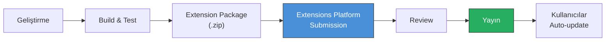
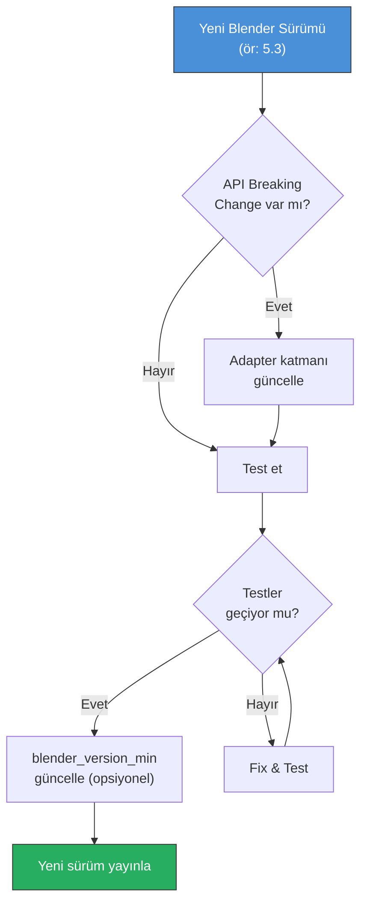

# 10 — Güvenlik ve Dağıtım

> API key güvenliği, veri koruma, lisanslama, dağıtım stratejisi ve Extensions Platform yayını.

---

## 10.1 API Key Güvenliği

### Temel Kurallar

| Kural | Açıklama |
|:------|:---------|
| ❌ Source code'a yazma | API key hiçbir `.py` dosyasında olmamalı |
| ❌ Repository'ye commit etme | `.gitignore` ile korunmalı |
| ❌ Log'a yazma | Logger API key'leri filtrelemeli |
| ❌ Hata mesajında gösterme | Raw exception kullanıcıya gösterilmemeli |
| ✅ Blender Preferences kullan | `subtype='PASSWORD'` ile güvenli giriş |
| ✅ Environment variable destekle | `AI_TEXTURE_*` prefix ile |

### Saklama Mekanizmaları

#### 1. Blender Preferences (Birincil)

```python
class AITexturePreferences(bpy.types.AddonPreferences):
    bl_idname = "ai_texture_painter"
    
    openai_api_key: bpy.props.StringProperty(
        name="OpenAI API Key",
        subtype='PASSWORD',  # UI'da maskelenir
        description="OpenAI API anahtarınız",
    )
```

> Blender preferences dosyası (`userpref.blend`) ile birlikte kaydedilir. Bu dosya genellikle `~/.config/blender/5.2/config/userpref.blend` konumundadır.

#### 2. Environment Variables (İkincil)

```python
import os

def get_api_key(provider_name: str) -> str:
    """API key'i güvenli şekilde al"""
    
    # 1. Önce environment variable kontrol et
    env_key = f"AI_TEXTURE_{provider_name.upper()}_API_KEY"
    env_value = os.environ.get(env_key)
    if env_value:
        return env_value
    
    # 2. Blender preferences'tan al
    prefs = get_addon_preferences()
    key_attr = f"{provider_name.lower()}_api_key"
    pref_value = getattr(prefs, key_attr, "")
    if pref_value:
        return pref_value
    
    return ""
```

#### Desteklenen Environment Variables

| Variable | Provider |
|:---------|:---------|
| `AI_TEXTURE_OPENAI_API_KEY` | OpenAI |
| `AI_TEXTURE_FLUX_API_KEY` | Flux / Replicate |
| `AI_TEXTURE_GEMINI_API_KEY` | Google Gemini |
| `AI_TEXTURE_LOCAL_URL` | Local AI server URL |

### API Key Log Filtresi

```python
class SecureLogger:
    """API key'leri otomatik maskeleyen logger"""
    
    SENSITIVE_PATTERNS = [
        'api_key', 'api-key', 'apikey',
        'secret', 'token', 'password',
        'authorization', 'bearer',
    ]
    
    @staticmethod
    def sanitize(message: str, **kwargs) -> str:
        """Log mesajından hassas verileri temizle"""
        sanitized_kwargs = {}
        for key, value in kwargs.items():
            if any(
                pattern in key.lower()
                for pattern in SecureLogger.SENSITIVE_PATTERNS
            ):
                sanitized_kwargs[key] = "***REDACTED***"
            else:
                sanitized_kwargs[key] = value
        
        return message, sanitized_kwargs
```

---

## 10.2 Veri Koruma

### Kullanıcı Verisi

| Veri Tipi | Yerel Kalır | Sunucuya Gider | Notlar |
|:----------|:------------|:---------------|:-------|
| Texture pixel data | ✅ | ⚠️ Provider'a gönderilir | Generation için zorunlu |
| Mask data | ✅ | ⚠️ Provider'a gönderilir | Inpaint için zorunlu |
| Prompt text | ✅ | ⚠️ Provider'a gönderilir | Generation için zorunlu |
| Reference image | ✅ | ⚠️ Provider'a gönderilir | Opsiyonel |
| API key | ✅ | ✅ Auth header | Her request'te |
| Blender dosyası | ✅ | ❌ | Asla gönderilmez |
| 3D model verisi | ✅ | ❌ | Asla gönderilmez |
| UV koordinatları | ✅ | ❌ | Asla gönderilmez |

### Gizlilik Bildirimi

```
AI Texture Painter aşağıdaki verileri seçtiğiniz AI provider'a gönderir:
- Texture image (veya maskeli bölgesi)
- Mask data
- Prompt metni
- Reference image (eklediyseniz)

Bu veriler AI generation için gereklidir. Provider'ın gizlilik 
politikası geçerlidir. Local AI kullanıyorsanız veriler cihazınızdan 
çıkmaz.
```

### Network İzinleri

```toml
# blender_manifest.toml
[permissions]
network = "AI provider API'lerine HTTP istekleri göndermek için gerekli"
files = "Texture dosyalarını okuma/yazma ve cache yönetimi için gerekli"
```

> Blender 5.x Extensions, network ve file erişimi gerektiren extension'lar için kullanıcıya açık izin bildirimi yapar.

---

## 10.3 Lisanslama

### Extension Lisansı

```toml
# blender_manifest.toml
license = ["SPDX:GPL-3.0-or-later"]
```

**Neden GPL-3.0?**
- Blender Extensions Platform gereksinimleri
- Blender kendisi GPL-2.0-or-later
- Açık kaynak topluluk uyumu
- Blender API kullanımı GPL gerektiriyor

### Bağımlılık Lisansları

| Paket | Lisans | Uyumluluk |
|:------|:-------|:----------|
| `httpx` | BSD-3-Clause | ✅ GPL uyumlu |
| `httpcore` | BSD-3-Clause | ✅ GPL uyumlu |
| `anyio` | MIT | ✅ GPL uyumlu |
| `certifi` | MPL-2.0 | ✅ GPL uyumlu |
| `h11` | MIT | ✅ GPL uyumlu |
| `idna` | BSD-3-Clause | ✅ GPL uyumlu |
| `sniffio` | MIT/Apache-2.0 | ✅ GPL uyumlu |
| `numpy` | BSD-3-Clause | ✅ GPL uyumlu (Blender bundled) |

### NOTICE Dosyası

```
AI Texture Painter
Copyright (c) 2026 Inkbytefo

This add-on is licensed under the GNU General Public License v3.0 
or later (GPL-3.0-or-later).

This software uses the following third-party libraries:
- httpx (BSD-3-Clause) - https://github.com/encode/httpx
- numpy (BSD-3-Clause) - bundled with Blender
```

---

## 10.4 Dağıtım Stratejisi

### Blender Extensions Platform (Birincil)



### Package Oluşturma

```bash
# 1. Dizin yapısını hazırla
ai_texture_painter/
├── blender_manifest.toml
├── __init__.py
├── core/
├── ai/
├── texture/
├── blender/
├── operators/
├── ui/
├── utils/
└── wheels/

# 2. Wheel'ları indir
pip download httpx --dest ai_texture_painter/wheels/ \
    --python-version 3.13 --only-binary=:all:

# 3. ZIP oluştur
cd ..
zip -r ai_texture_painter.zip ai_texture_painter/ \
    -x "ai_texture_painter/__pycache__/*" \
    -x "ai_texture_painter/**/__pycache__/*" \
    -x "*.pyc"

# 4. Blender CLI ile doğrula
blender --command extension validate ai_texture_painter.zip
```

### Manifest Doğrulama Kontrol Listesi

```markdown
Extensions Platform'a göndermeden önce:

- [ ] `blender_manifest.toml` var ve geçerli
- [ ] `schema_version` = "1.0.0"
- [ ] `id` benzersiz ve küçük harflerle
- [ ] `version` SemVer formatında
- [ ] `blender_version_min` doğru ayarlanmış
- [ ] `license` SPDX formatında
- [ ] `permissions` tanımlı (network, files)
- [ ] `wheels` listesi doğru ve dosyalar mevcut
- [ ] `tagline` 64 karakter veya daha kısa
- [ ] `bl_info` kullanılmıyor (eski sistem)
- [ ] Tüm `__pycache__` temizlenmiş
- [ ] Test paketleri dahil edilmemiş
```

### Alternatif Dağıtım

| Kanal | Kullanım | Öncelik |
|:------|:---------|:--------|
| **Extensions Platform** | Ana dağıtım kanalı | 🔴 Kritik |
| **GitHub Releases** | Manuel indirme, beta sürümler | 🟡 Yüksek |
| **Gumroad/Blender Market** | Ücretli premium sürüm (varsa) | 🟢 Opsiyonel |
| **Itch.io** | Indie topluluk erişimi | 🟢 Opsiyonel |

---

## 10.5 Sürüm Yönetimi

### Semantic Versioning

```
MAJOR.MINOR.PATCH

0.1.0  — İlk MVP
0.1.1  — Bug fix
0.2.0  — 3D Integration eklendi
0.3.0  — Multi-provider
1.0.0  — İlk kararlı sürüm
```

### Blender Uyumluluk Güncelleme

```toml
# Her Blender sürüm güncellemesinde kontrol et:
blender_version_min = "5.0.0"

# Belirli sürümle test edilmiş:
# Tested with: 5.0.0, 5.1.0, 5.2.0 LTS
```

### Güncelleme Stratejisi



---

## 10.6 Build & Release Otomasyonu

### Build Script

```python
#!/usr/bin/env python3
"""AI Texture Painter build script"""

import os
import shutil
import zipfile
import subprocess
import sys

ADDON_NAME = "ai_texture_painter"
BUILD_DIR = "build"
DIST_DIR = "dist"

def clean():
    """Build artıklarını temizle"""
    for d in [BUILD_DIR, DIST_DIR]:
        if os.path.exists(d):
            shutil.rmtree(d)

def download_wheels():
    """Python wheel bağımlılıklarını indir"""
    wheels_dir = os.path.join(BUILD_DIR, ADDON_NAME, "wheels")
    os.makedirs(wheels_dir, exist_ok=True)
    
    subprocess.run([
        sys.executable, "-m", "pip", "download",
        "httpx>=0.27",
        "--dest", wheels_dir,
        "--python-version", "3.13",
        "--only-binary=:all:",
    ], check=True)

def copy_source():
    """Kaynak kodu build dizinine kopyala"""
    src = ADDON_NAME
    dst = os.path.join(BUILD_DIR, ADDON_NAME)
    
    shutil.copytree(src, dst, ignore=shutil.ignore_patterns(
        '__pycache__', '*.pyc', '.git', 'tests',
        '.env', '*.key', 'api_keys.json',
    ))

def create_zip():
    """Extension ZIP paketi oluştur"""
    os.makedirs(DIST_DIR, exist_ok=True)
    
    # Version'ı manifest'ten oku
    import tomllib
    with open(os.path.join(BUILD_DIR, ADDON_NAME, 
              "blender_manifest.toml"), "rb") as f:
        manifest = tomllib.load(f)
    
    version = manifest["version"]
    zip_name = f"{ADDON_NAME}-{version}.zip"
    zip_path = os.path.join(DIST_DIR, zip_name)
    
    with zipfile.ZipFile(zip_path, 'w', zipfile.ZIP_DEFLATED) as zf:
        for root, dirs, files in os.walk(
            os.path.join(BUILD_DIR, ADDON_NAME)
        ):
            for file in files:
                file_path = os.path.join(root, file)
                arcname = os.path.relpath(file_path, BUILD_DIR)
                zf.write(file_path, arcname)
    
    print(f"✅ Built: {zip_path}")
    return zip_path

def validate(zip_path):
    """Blender CLI ile extension'ı doğrula"""
    result = subprocess.run([
        "blender", "--command", "extension", "validate", zip_path
    ], capture_output=True, text=True)
    
    if result.returncode == 0:
        print("✅ Validation passed")
    else:
        print(f"❌ Validation failed:\n{result.stderr}")
        sys.exit(1)

def build():
    """Full build pipeline"""
    clean()
    copy_source()
    download_wheels()
    zip_path = create_zip()
    validate(zip_path)

if __name__ == "__main__":
    build()
```

### Release Checklist

```markdown
Yeni sürüm yayınlamadan önce:

## Kod Kalitesi
- [ ] Tüm unit testler geçiyor
- [ ] Integration testler geçiyor
- [ ] Linting hataları yok (ruff)
- [ ] Type checking geçiyor (mypy)

## Uyumluluk
- [ ] Blender 5.0'da test edildi
- [ ] Blender 5.2 LTS'te test edildi
- [ ] Windows'ta test edildi
- [ ] macOS'ta test edildi (mümkünse)
- [ ] Linux'ta test edildi (mümkünse)

## Güvenlik
- [ ] API key kaynak kodda yok
- [ ] .gitignore güncel
- [ ] Log'larda hassas veri yok
- [ ] Secrets commit edilmemiş

## Paketleme
- [ ] `blender_manifest.toml` version güncellendi
- [ ] Wheel'lar tüm platformlar için mevcut
- [ ] ZIP paketi oluşturuldu
- [ ] `blender --command extension validate` geçiyor

## Dokümantasyon
- [ ] CHANGELOG güncellendi
- [ ] Release notes yazıldı
- [ ] API değişiklikleri dokümante edildi

## Dağıtım
- [ ] GitHub tag oluşturuldu
- [ ] GitHub Release yayınlandı
- [ ] Extensions Platform'a gönderildi
```

---

## 10.7 Hata Raporlama

### Kullanıcı Hata Raporu Template

```markdown
## Hata Açıklaması
[Hatanın kısa açıklaması]

## Yeniden Üretme Adımları
1. ...
2. ...
3. ...

## Beklenen Davranış
[Ne olması gerekiyordu]

## Gerçek Davranış
[Ne oldu]

## Ortam
- Blender sürümü: 
- AI Texture Painter sürümü: 
- İşletim sistemi: 
- AI Provider: 
- GPU: 

## Loglar
[Blender console çıktısı]

## Ekran Görüntüsü
[Varsa]
```

### Hata Toplama (Opsiyonel)

```python
def generate_debug_report() -> str:
    """Debug raporu oluştur (kullanıcı isteğiyle)"""
    import platform
    
    report = {
        'addon_version': get_addon_version(),
        'blender_version': bpy.app.version_string,
        'python_version': platform.python_version(),
        'os': platform.platform(),
        'gpu': get_gpu_info(),
        'active_provider': get_active_provider_name(),
        'log_tail': get_last_log_lines(50),
    }
    
    # API key'ler ve kişisel veri DAHİL EDİLMEZ
    return json.dumps(report, indent=2)
```

---

## 10.8 Destek ve İletişim

### Destek Kanalları

| Kanal | Amaç | Bağlantı |
|:------|:------|:---------|
| GitHub Issues | Hata raporları, özellik istekleri | `github.com/inkbytefo/ai-texture-painter` |
| Blender Artists | Topluluk tartışmaları | Blender Artists forumu |
| Discord | Canlı destek, topluluk | (Oluşturulacak) |
| E-posta | Ticari sorular | `contact@inkbytefo.com` |

---

*📚 Dokümantasyonun sonuna ulaştınız. [Ana sayfaya dönün](./README.md)*
